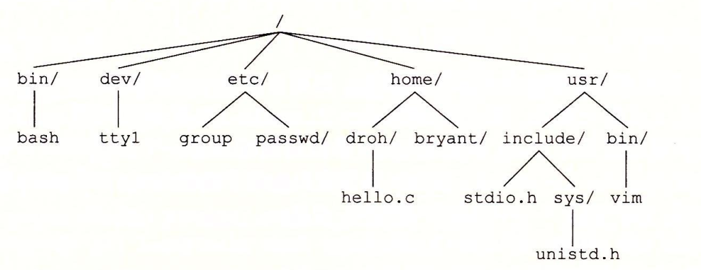
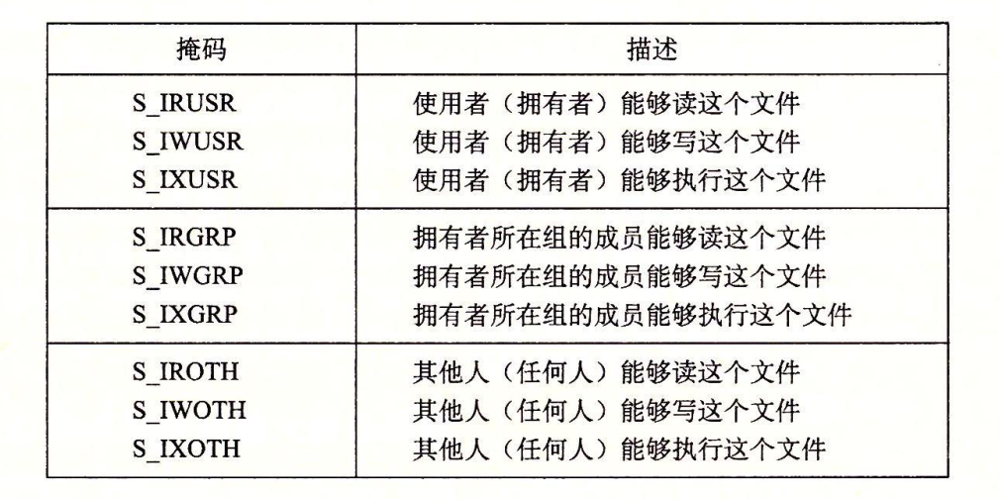
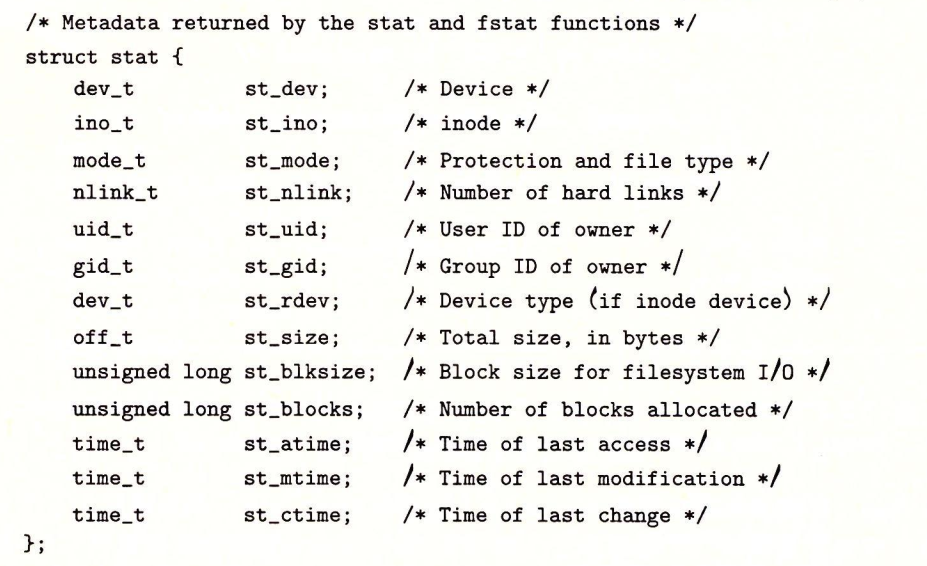
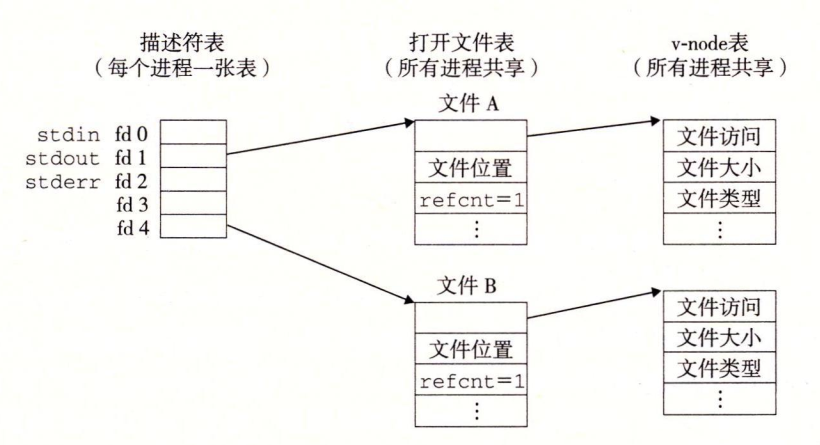
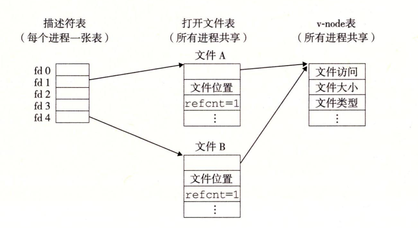
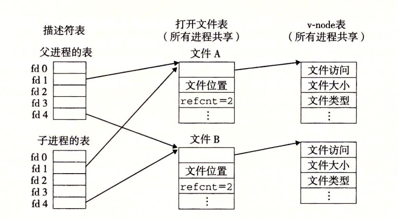

# 深入理解计算机系统——第10章 系统级I/O

# 参考资料

* [《深入理解计算机系统》学习笔记整理（CSAPP 学习笔记）](https://www.cnblogs.com/xsqblogs/p/14688428.html)

# 系统级I/O

### 概念

输入/输出是**在主存和外部设备之间复制数据**的过程：

1. 输入从 IO 设备复制数据到主存
2. 输出从主存复制数据到 IO 设备

在 Linux 系统中，C/C++ 等高级语言的 I/O 函数都是通过内核提供的系统及 **Unix I/O** 实现的。

学习 Unix I/O 的意义：

1. I/O 是系统操作不可或缺的一部分。如 I/O 在进程的创建和执行中扮演者关键的角色。
2. 有时只能使用 Unix I/O，比如读取文件的元数据（如文件大小、文件创建时间等）。

##  Unix I/O

一个 Linux 文件就是一个m个字节序列：

* B0,B1,B2,...,Bk,...Bm-1

**所有的 I/O 设备都被模型化为文件**，如网络、磁盘等，所有的输入和输出都被当做对相应文件的读和写来执行。

Linux 内核使用 **Unix I/O 来作为处理文件的接口**，它以一种统一且一致的方式来执行所有的输入和输出：

1. **打开文件**：应用程序通过要求内核**打开相应的文件来访问一个 I/O 设备**，内核返回一个用**非负整数表示的描述符**来标识这个文件。内核会记录有关这个打开文件的所有信息，应用程序只需记住描述符。
2. Linux shell 创建的**每个进程开始时都有三个打开的文件：标准输入（描述符为 0）**，**标准输出（描述符为 1），标准错误（描述符为 2）**。
3. **改变当前的文件位置：对于每个打开的文件，内核保持着一个文件位置 k**，它是从文件开头起始的字节偏移量，初始为 0。**可以通过 seek 函数来显式设置当前位置 k。**
4. **读写文件**：一个读操作就是从文件复制数据到内存。当读取到文件末尾会触发一个 EOF(end of file) 条件。写操作就是从内存复制数据到文件。
5. **关闭文件**：内核关闭文件时，释放打开文件时创建的数据结构，并将描述符恢复到可用的描述符池中。当一个进程终止，内核就会关闭所有打开的文件并释放它们的内存资源

对应函数如下：

```c++
int open(char *filename, int flags, mode_t mode); //若成功则返回文件描述符，若出错返回 -1
int close(int fd); // fd 是一个文件描述符
ssize_t read(int fd, void *buf, size_t n);          //若成功则返回读的字节数，若 EOF 则返回 0，若出错返回 -1
ssize_t write(int fd, const void *buf, size_t n);   //若成功返回写的字节数，若出错返回 -1
int stat(const char *filename, struct stat *buf);
int fstat(int fd, struct stat *buf);
lseek(); //更改当前文件位置，这里没细讲。
```

## 文件

Linux 文件有不同的类型：

1. **普通文件**：包含任意数据。应用程序常会将普通文件进一步分为文本文件（只包含 ASCII 或 Unicode 字符的文件）和二进制文件（其他所有文件）。对内核而言，两者没有区别。
2. **目录：**包含一组链接的文件，其中每一个链接都是一个文件名。**每个目录至少含有两个条目：“.” 表示到该目录自身的链接，“..” 表示到目录层次结构中父目录的链接。**
3. **套接字**：用来与另一个进程进行网络通信的文件。
4. **其他文件**：命令通道、符号链接，以及字符和块设备。

Linux 将所有的文件组织成一个目录层次结构，由**根目录 (/)** 确定



每个进程都有一个**当前工作目录**。

目录层次结构中的位置用路径名来指定，路径名有两种形式：

1. **绝对路径名：**以一个斜杠开始，表示从根节点开始的路径
2. **相对路径名**：以文件名（包括目录）开始，表示从当前工作目录开始的路径。如 ./hello.c （斜杠前的点表示当前目录）

## 打开和关闭文件

进程通过调用 **open 函数**打开一个已存在的文件或创建一个新文件。

```c++
#include <sys/types.h>
#include <sys/stat.h>
#include <fcntl.h>

int open(char *filename, int flags, mode_t mode); //若成功则返回文件描述符，若出错返回 -1
```

**open 函数返回一个文件描述符**，返回的描述符总是在进程中当前没有打开的最小描述符。

**flag 参数**指明进程如何访问这个文件：

1. O_RDONLY：只读
2. O_WRONLY：只写
3. O_RDWR：可读可写
4. O_CREAT：如果文件不存在，就创建它的一个截断的（空）文件
5. O_TRUNC：如果文件已存在，就截断它
6. O_APPEND：在写操作前，设置文件位置到文件的结尾处。

例如，使用只读形式打开一个文件,并向尾部添加数据：

```
fd = open("foo.txt", O_WRONLY|O_APPEND, 0);
```

**mode 参数**指定新文件的访问权限位。

每个进程都有一个 **umask**，它是通过调用 umask 函数创建的，当进程通过带有 mode 参数的 open 函数来创建一个新文件时，文件的访问权限位被设置为 mode & ~umask。

假设，给定下面的mode和umask默认值：

```
#define DEF_MODE S_IRUSER|S_IWUSER|S_IRGRP|S_IWGRP|S_IROTH|S_IWOTH   例如 110 110 110
#define DEF_UMASK S_IWGRP|S_IWOTH  例如 000 010 010    			   取反  111 101 101  
																	 最终  110 100 100
umask(DEF_UMASK)
fd=open("foo.txt",O_CREAT|O_TRUNC|O_WRONLY,DEF_MODE)   //因此文件拥有者具有读写权限，其他用户都只有读权限
```

 

进程通过 **close 函数**关闭一个打开的文件，关闭一个已关闭的描述符会出错。

```c++
#include <unistd.h>
int close(int fd); // fd 是一个文件描述符
```


## 读和写文件

应用程序通过调用 read 和 write 函数来执行输入和输出。

```c++
#include<unistd.h>
ssize_t read(int fd, void *buf, size_t n);          //若成功则返回读的字节数，若 EOF 则返回 0，若出错返回 -1
ssize_t write(int fd, const void *buf, size_t n);   //若成功返回写的字节数，若出错返回 -1
```

read 函数从描述符为 fd 的当前文件位置复制最多 n 个字节到内存位置 buf。

write 函数从内存位置 buf 复制最多 n 个字节到描述符 fd 的当前文件位置。

ssize_t 和 size_t 的区别：

1. size_t 是 unsigned long
2. ssize_t 是 long

read 和 write 传送的字节少于 n （称为**不足值**）的情况：

1. 读时遇到 EOF
2. 从终端（键盘、显示器等）读文本行时，每个 read 函数一次传送一个文本行
3. 读和写网络套接字

## 读取文件元数据

通过 stat 和 fstat 函数可以读取文件的元数据。

```c++
#include <sys/stat.h>
#include <unistd.h>
int stat(const char *filename, struct stat *buf);
int fstat(int fd, struct stat *buf);
```

stat 函数以文件名为输入，填写 stat 结构体中的各个成员。fstat 函数与 stat 相似，但是以文件描述符为输入。



stat 数据结构中，st_mode 成员编码了文件访问许可位和文件类型，st_size 成员包含了文件的字节数大小。

Linux 在 sys/stat.h 中定义了宏谓词（谓词函数）来确定 st_mode 成员的数据类型：

1. S_ISREG(mode_t m)。是否是一个普通文件
2. S_ISGIR(mode_t m)。是否是一个目录文件
3. S_ISSOCK(mode_t m)。是否是一个网络套接字

## 读取目录和内容

可以使用 readdir 系列函数读取目录的内容。

**opendir 函数**

```c++
#include<sys/types.h>
#include<dirent.h>
DIR *opendir(const char *name); //若成功，返回指向目录流的指针；若出错，返回 NULL
```

流是对有序列表的抽象。函数 opendir 以路径名为参数，返回指向目录流（即目录项的列表）的指针。

**readdir 函数**

```c++
#include<dirent.h>
struct dirent *readdir(DIR *dirp);//若成功，返回指向下一个目录项的指针；若没有更多的目录项或出错，返回 NULL
```

函数 readdir 返回指向流 dirp 中下一个目录项的指针。若没有更多的目录项或出错，返回 NULL。其中如果出错 readdir 还会设置 errno。

可以通过检查 errno 是否被修改过来区分是出错还是没有更多的目录项

每个目录项都是一个结构:

```c++
struct dirent{
    ino_t d_ino;//文件位置
    char d_name[256];//文件名
}
```

**closedir 函数**

```c++
#include<dirent.h>
int closedir(DIR *dirp);
```

函数 closedir 关闭流并释放所有的资源。

## 共享文件

可以使用多种方式来共享 Linux 文件。

**内核表示打开的文件的方式**。内核使用**三个相关的数据结构**来表示打开的文件：

1. **描述符表。每个进程**都有自己独立的描述符表，表项是由进程**打开的文件描述符**索引的。每个打开的描述符表项**指向文件表中的一个表项**。

2. **文件表。**文件表中包含打开文件的集合，**所有的进程共享一个文件表**。文件表中的每个表项包括：**当前的文件位置(在文件中的读取位置，而不是文件所在位置)、引用计数（当前指向该文件的描述符表项数）**，一个指向 v-node 表中对应表项的指针。

3. 1. 引用计数：关闭一个描述符会减少相应的文件表表项中的引用计数，当引用计数减到 0，内核就删除该表项。

4. **v-node 表。所有的进程共享一个 v-node 表。**每个表项包含 **stat 结构（文件的元数据）中的大多数信息**，包括 st_mode 和 st_size 成员。

描述符1和4通过不同的打开文件表项来引用两个不同的文件。

 

多个描述符通过不同的文件表表项来引用同一个文件。例如，以同一个filename调用open函数两次，就会发生这种情况。关键思想是每个描述符都有它自己的文件位置，所以对不同描述符的读操作可以从文件的不同位置获取数据。

 

父子进程共享打开的文件描述符：

 

## 标准I/O

C 语言定义了一个**标准 I/O 库**，为程序员提供了 Unix I/O 的较高级别的替代，它包括（但不止以下这些）：

1. **fopen 和 fclose ：**打开和关闭文件
2. **fread 和 fwrite** ：读字节和写字节
3. **fgets 和 fputs ：**读字符串和写字符串
4. **scanf 和 printf ：**复杂的格式化的 I/O 函数

标准 I/O 库将一个打开的文件模型化为一个流，一个流就是一个指向 FILE 类型的结构的指针。每个 ANSI C 程序开始时都有三个打开的流：stdin, stdout, stderr

```c++
#include<stdio.h>
extern FILE *stdin;   //标准输入（描述符为0）
extern FILE *stdout;  //标准输出（描述符为1）
extern FILE *stderr;  //标准错误（描述符为2）            
```

**类型为 FILE 的流**是对文件描述符和流缓冲区的抽象。

**流缓冲区**的目的和 RIO 读缓冲区的目的一样：**使开销较高的 Linux I/O 系统调用的数量尽可能小。**

**一个示例**

比如有个程序要反复调用标准 I/O 的 getc 函数，每次读取一个字符。当第一次调用 getc 时，库通过调用一次 read 函数来填充缓冲区，然后将缓冲区中的第一个字节返回给应用程序。只要缓冲区还有未读字节，接下来 getc 都直接从流缓冲区得到服务。

初始的虚拟地址空间中的虚拟页基本都是未分配的，当调用了 malloc 就会分配一个或一些新的虚拟页，这些页指向磁盘上的对应页面。

理解：或许是因为 malloc 只负责分配内存，不负责创建对象，所以 malloc 分配得到的页是未缓存的。

## 小结

* linx提供了少量的基于Unix I/O模型的系统级函数，它们允许应用程序打开、关闭、读和协文件，提取文件的元数据，以及执行I/O重定向。
* linux 内核使用 **描述符表、文件表和v-node表**，来表示打开的文件
* 标准I/O库是基于 Unix I/O 实现的，并提供了一组强大的高级I/O例程。
