# 深入理解计算机系统——第12章 并发编程

# 参考资料

* [《深入理解计算机系统》学习笔记整理（CSAPP 学习笔记）](https://www.cnblogs.com/xsqblogs/p/14688428.html)

# 并发编程

如果逻辑控制流在时间上重叠，那么就称它们是并发的。注意：<font color='red'>核心是在时间上重叠。</font>

操作系统内核运行多个应用程序采用了并发机制，但并发不止用于内核，也用于应用程序中。应用级并发的一些应用场合：

* <font color='red'>访问慢速 I/O 设备。</font>当一个用户等待来自慢速 I/O 设备（比如磁盘）的数据到达时，内核会运行其他进程。
* <font color='red'>与人交互。</font>每次用户请求某种操作时（比如通过点击鼠标），一个独立的并发逻辑流被创建来执行这个操作。
* <font color='red'>通过推迟工作以降低延迟。</font>
* <font color='red'>服务多个网络客户端。</font>一个并发服务器为每个客户端创建一个单独的逻辑流。
* <font color='red'>在多核机器上进行并行计算。</font>被划分称并发流的应用程序通常在多个机器上比单处理器机器上快很多，因为这些流会并行执行，而不是交错执行。

现代操作系统提供了三种基本的构造并发程序的方法：

* 进程。在这种形式下，每个逻辑控制流都是一个进程，由内核来调度和维护。因为进程有独立的虚拟地址空间，想要和其他流通信，控制流必须使用显式的进程间通信（IPC）机制。
* I/O 多路复用。在这种形式下，应用程序在一个进程的上下文中显式地调用它们自己的逻辑流。逻辑流被模型化为状态机，数据到达文件描述符后，主程序显式地从一个状态转换到另一个状态。因为程序是一个单独的进程，所以所有的流都共享同一个地址空间。
* 线程。线程是运行在一个单一进程上下文中的逻辑流，由内核进行调度。线程像进程流一样由内核进行调度，像 I/O 多路复用一样共享同一个虚拟地址空间。

##  基于进程的并发编程

构造并发程序最简单的方法就是用进程，使用 fork, exec, waitpid 等函数。

一个构造并发服务器的自然方法就是在父进程中接受客户端连接请求，然后创建一个新的子进程来为每个客户端提供服务。


上图中，服务器正在监听一个监听描述符（listenfd3）上的连接请求。然后服务器接受了客户端 1 的连接请求，返回给客户端 1 一个已连接描述符（connfd4）。这之后服务器要进行如下操作：
派生一个子进程，这个子进程获得服务器描述符表的完整副本。
子进程关闭它的副本中的监听描述符 listenfd3。
父进程关闭它的已连接描述符 connfd4 的副本。
因为父、子进程中的已连接描述符 connfd4 指向同一个文件表表项，所以父进程必须关闭它的 connfd 的副本，否则将永远不会释放 connfd4 的文件表条目，导致内存泄漏，进而耗光内存，系统崩溃。

### 基于进程的并发服务器

一个基于进程的并发 echo 服务器:

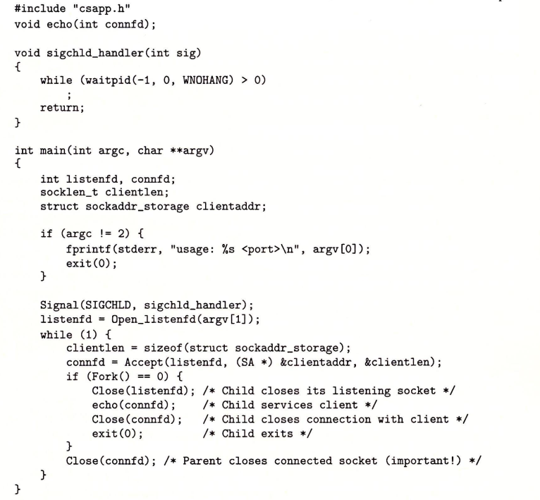


### 进程的优劣

优点：父子进程间共享状态信息：共享文件表，但是不共享用户地址空间。这样避免了一个进程覆盖另外一个进程的虚拟内存。

缺点：独立的地址空间使得进程共享状态信息变得更加困难，需要使用进程间通信(IPC)机制。

## 基于I/O多路复用的并发编程

 假设编写一个echo服务器，它也能对用户从标准输入的交互命令做出响应，这样的情况下，服务器必须响应两个互相独立的I/O事件：

1. 网络客户端发起连接请求，

2. 用户在键盘上输入命令行。

那么这两个事件没有哪个选择是理想的，如果在accept中等待一个连接请求，那么就不能响应输入的命令，如果在read中等待一个输入命令，就不能响应任何连接请求。

针对这种困境的一个解决办法就是<font color='red'>I/O多路复用技术</font>。基本思想就是使用select函数，要求内核挂起进程，只有在一个或多个I/O事件发生后，才将控制返回给应用程序。

```c
 #include <sys/time.h>
 #include <sys/types.h>
 #include <unistd.h>

//返回已准备好的描述符的非0的个数，出错返回-1
int select(int nfds, fd_set *readfds, fd_set *writefds,
              fd_set *exceptfds, struct timeval *timeout);
//处理描述符集合的宏
void FD_CLR(int fd, fd_set *set);    //清空set中fd的位
int  FD_ISSET(int fd, fd_set *set);  //判断set中fd位
void FD_SET(int fd, fd_set *set);    //将set中fd置位
void FD_ZERO(fd_set *set);           //清空set中所有位
```


select函数处理类型为fd_set的集合，也叫描述符集合，逻辑上将描述符集合看成一个大小为n的位向量（bn-1,....b1,b0）。每个位对应一个描述符，当bk=1时，描述符k才表明是描述符集合的一个元素，只允许你对描述符集合做三件事：

1. 分配他们
2. 将一个此种类型的变量赋值给另一个变量。
3. 用FD_ZERO、FD_SET、FD_CLR和FD_ISSET宏来修改和检查它们。

针对我们的目的，select函数有两个输入，一个称为读集合的描述符集合（fdset）和该读集合的基数（n）。select函数会一直阻塞，直到读集合中至少有一个描述符准备好可以读，当且仅当一个从该描述符读取字节的请求时不会阻塞时，描述符k就表示准备好了可以读，select有一个副作用，它修改参数fdset指向的fd_set，指明读一个集合的子集，称为准备好集合，这个集合是由读集合中准备好可以读了的描述符组成的，该函数返回的值指明了准备好集合的基数，由于这个副作用必须在每次调用select时都更新读集合。


### 基于IO多路复用的并发事件驱动服务器

IO多路复用可以用到并发事件驱动程序的基础，在事件驱动程序中某些事件会导致流向前推进，一般的思路是将逻辑流模型转化为状态机，不严格的说一个状态机就是一组状态、输入时间和转移。其中转移就是将状态和输入事件映射到状态，每个转移就是将一个（输入状态、输入事件）对映射到一个输出状态。自循环是同一输入和输出状态之间的转移。通常把状态机画成有向图，其中节点表示状态，有向弧表示转移，而弧上的标号表示输入事件，一个状态机从某种状态开始执行。

对于每个新的客户端k，基于IO多路复用的并发服务器会创建一个新的状态机Sk，并将它和已连接描述符dk联系起来，如下图每个状态机都有一个状态（等待描述符dk准备好可读）、一个输入事件（描述符dk准备好可以读了）和一个转移（从描述符dk读一个文本行）。

服务器使用IO多路复用借助select函数检测输入事件的发生，当每个已连接描述符准备好可读时，服务器就为相应的状态机执行转移，在这里就是从描述符读和写回一个文本行。
    
### IO多路复用技术的优劣
事件驱动设计的优点：

* 它比基于进程的设计给了程序员更多对程序行为的控制。例如，我们可以编写一个事件驱动的并发服务器，为某些客户端提供它们需要的服务，而对于基于进程的并发服务器来说是很困难的。
* 一个基于IO多路复用的事件驱动服务器试运行在单一进程上下文中的，因此每个逻辑流都能访问该进程的全部地址空间，这使得流之间共享数据变得很容易
* 一个与作为单个进程运行相关的优点是，你可以利用熟悉的调试工具例如GDB，来调试你的并发服务器，就像对顺序程序那样
* 比基于进程的设计要高效的多，因为他们不需要进程上下文切换来调度新的流。

事件驱动设计的缺点：

* 编码复杂，上面的事件驱动并发echo服务器需要的代码比基于进程的服务器多三倍，随着并发粒度的减小，复杂性还会上升，这里的粒度是指每个逻辑流每个时间片执行的指令数量。
* 不能充分利用多核处理器。

## 基于线程的并发编程

到目前为止，前面看到了两种创建并发逻辑流的方法，第一种方法中，每个流使用了单独的进程，内核会自动调度每个进程，而每个进程有自己的私有地址空间，使流之间共享数据很困难。第二种方法中，创建自己的逻辑流，并利用IO多路复用来显式地调度流。因为只有一个进程，所有的流共享整个地址空间，本节介绍第三种方法，基于线程，它是之前地两种方法的混合。

线程是运行在进程上下文中的逻辑流，在之前程序都是由每个进程中一个线程组成的，现代操作系统允许我们编写一个进程里运行多个线程的程序，线程由内核自动调度。每个线程都有自己的线程上下文，<font color='red'>包括一个唯一的整数线程ID，栈、栈指针、程序计数器、通用目的寄存器和条件码，所有运行在一个进程里的线程共享该进程的整个虚拟地址空间</font>。
    
基于线程的逻辑流结合了基于进程和基于IO多路复用的流的特征，同进程一样，线程由内核自动调度，并且内核通过一个整数ID来识别线程。同基于IO多路复用的流一样，多个线程运行在单一进程的上下文中，共享这个进程虚拟地址空间的所有内容，包括它的代码、数据、堆、共享库和打开的文件。

### 线程执行模型

多线程的执行模型在某些方面和多进程的执行模型是相似的。如下图所示：

 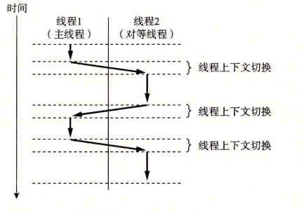

每个进程开始生命周期时都是单一线程，这个线程被称为主线程，在某一时刻，主线程创建一个对等线程，从这个时间点开始，两个线程就并发的运行，最后主线程执行一个慢速系统调用，例如read或者sleep，或者因为被系统的间隔计时器中断，控制就会通过上下文切换传递到对等线程，对等线程会执行一段时间，然后控制传回主线程，依次类推。

线程执行在一些方面和进程是不同的，因为一个线程的上下文比一个进程的上下文小得多，线程的上下文切换要比进程快得多。另一个不同的是线程不像进程那样，不是按照严格的父子层次来组织的，和一个进程相关的线程组成一个对等（线程）池，独立于其他线程创建的线程。主线程和其他线程的区别仅在于它总是进程中第一个运行的线程。对等（线程）池的概念主要影响的是一个线程可以杀死它的任何对等线程或者等待它的任意对等线程终止。另外每个对等线程都能读写相同的共享数据。

### Posix线程

Posix线程(Pthreads)是C程序中处理线程的一个标准接口。Pthreads定义了大约60个函数，允许程序创建、杀死和回收线程，与对等线程安全的共享数据，还可以通知对等线程系统状态的变化。

下图是一个简单的Pthreads程序：

* 主线程创建一个对等线程，然后等待它终止
* 对等线程输出“Hello，world!”并且终止
* 当主线程检测到对等线程终止后，它就调用exit终止该进程。线程的代码和本地数据都被封装在一个线程例程中，每个线程例程都以一个通用指针作为输入，并返回一个通用指针。如果想要传递多个参数给线程例程那应该将参数放到一个结构中，并传递一个指向该结构的指针。

```c
#include"csapp.h"

void *thread(void *vargp)

int main()
{
    pthread_t tid;
    pthread_create(&tid,NULL,thread,NULL);
    pthread_join(tid,NULL);
    exit(0);
}

void *thread(void *vargp)
{
    printf("hello world!");
    return NULL;
}
```

### 创建线程

线程通过调用pthread_create函数来创建其他线程。、

```c
#include <pthread.h>
//第一个参数为指向线程标识符的指针。
//第二个参数用来设置线程属性。
//第三个参数是线程运行函数的起始地址。
//最后一个参数是运行函数的参数。
int pthread_create(pthread_t *thread, const pthread_attr_t *attr,
                          void *(*start_routine) (void *), void *arg);

pthread_create函数能创建一个新的进程，并带着一个输入变量arg，attr参数用来改变创建线程的默认属性。当pthread_create返回时，参数tid包含新创建线程的ID，新线程可以通过调用pthread_self函数获得他自己的线程ID。

pthread_t pthread_self(void);

pthread_self获取自己的线程ID
```

### 终止线程

一个线程是以下列方式之一终止的：

1. 当顶层的线程例程返回时，线程会隐式地终止。
2. 通过调用pthread_exit函数，线程会显式终止，如果主线程调用pthread_exit，它会等待所有其他对等线程终止，再终止主线程和整个进程。返回值为thread_return。
3. 某个对等线程调用Linux的exit函数，该函数终止进程以及所有与该进程相关的线程
4. 另一个对等线程通过以当前线程ID作为参数调用pthread_cancel函数来终止当前线程。

```c
#include <pthread.h>

void pthread_exit(void *retval);
int pthread_cancel(pthread_t thread);
```
### 回收已终止线程的资源

线程通过pthread_join函数等待其他线程终止。

```c
#include <pthread.h>

int pthread_join(pthread_t tid, void **thread_return);
```

pthread_join函数会阻塞，直到线程tid终止，将线程例程返回的通用(void*)指针赋值为thread_return指向的位置，然后回收已终止线程占用的所有内存资源。

和wait函数不同，pthread_join函数只能只能等待一个指定的线程终止。没有办法让pthread_wait等待任意一个线程终止。

### 分离线程

在任何一个时间点上，线程是可结合的或者是分离的，一个可结合的线程能够被其他线程收回和杀死。在被其他线程回收之前它的内存资源（例如栈）是不释放的，相反一个分离的线程是不能被其他线程回收或杀死的。它的内存资源在它终止时由系统自动释放。

默认情况下，线程被创建成可结合的，为了避免内存泄露，每个可结合线程都要么被其他线程显式地收回要么调用pthread_detach函数被分离。

```c
#include <pthread.h>

int pthread_detach(pthread_t thread);
```

pthread_detach函数分离可结合线程tid，线程能够以pthread_self()为参数的pthread_detach调用来分离它们自己。

尽管我们的一些例子会使用可结合线程，但是现实程序中有很好的理由使用分离的线程。例如，一个高性能Web服务器可能在每次收到Web浏览器的连接请求时都创建一个新的对等线程，因为每个连接都由一个单独的线程独立处理的，所以对于服务器而言，就很没有必要显式地等待每个对等线程终止。在这个情况下，每个对等线程都应该在它开始处理请求之前分离它自身，这样就能它终止后回收它的内存资源。

### 初始化线程

pthread_once函数允许你初始化与线程例程相关的状态。

```c
#include<pthread.h>

pthread_once_t once_control=PTHREAD_ONCE_INIT;
int pthread_once(pthread_once_t *once_control, void (*init_routine) (void));

once_control变量是一个全局或者静态变量，总是被初始化为PTHREAD_ONCE_INIT。当你第一次用参数once_control调用pthread_once时，它调用init_routine，这是一个没有输入参数、也不返回什么的函数，接下来以once_control为参数的pthread_once调用不做任何事情，无论何时当你需要动态初始化多个线程共享的全局变量，pthread_once函数是有用的。
```
### 基于线程的并发服务器

 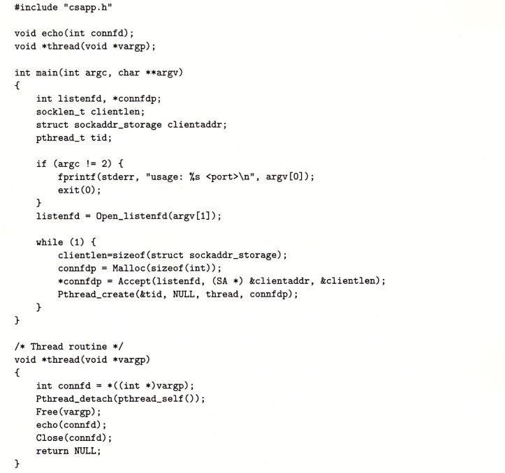


## 多线程程序中地共享变量

多线程的共享需要弄清楚几个问题。

1. 线程的基础内存模型是什么。
2. 根据这个模型，变量实例是如何映射到内存的。
3. 最后，有多少线程引用了这些实例。一个变量是共享的，当且仅当多个线程引用这个变量的某个实例。

### 线程内存模型

一组并发线程运行在一个进程的上下文中。<font color='red'>每个线程都有自己独立的线程上下文，包括线程ID、栈、栈指针、程序计数器、条件码和通用目的寄存器值。</font>每个线程和其他线程一起<font color='red'>共享进程上下文剩余部分</font>，其中包括整个用户虚拟地址空间，它是由只读文本（代码）、读写数据、堆以及所有的共享库代码和数据区域组成的，线程也共享相同的打开文件集合。

从实际操作角度来说，让一个线程去读写另一个线程的寄存器值是不可能的，另一方面，任何线程都可以访问共享虚拟内存的任意位置，如果某个线程修改了一个内存位置，那么其他每个线程最终都能在它读这个位置时发现这个变化，因此寄存器是不共享的，而虚拟内存总是共享的。

各自独立的线程栈的内存模型不是那么整齐清楚，这些栈被保存在虚拟地址空间的栈区域中，并且通常是被相应的线程独立的访问的，我们说的通常不是总是，因为不同的线程栈是不对其他线程设防的，所以如果<font color='red'>一个线程以某一种方式得到一个指向其他线程栈的指针</font>，那么它就可以读写这个栈的任何部分。如下图所示，其中对等线程直接通过全局变量ptr间接引用主线程的栈的内容。

 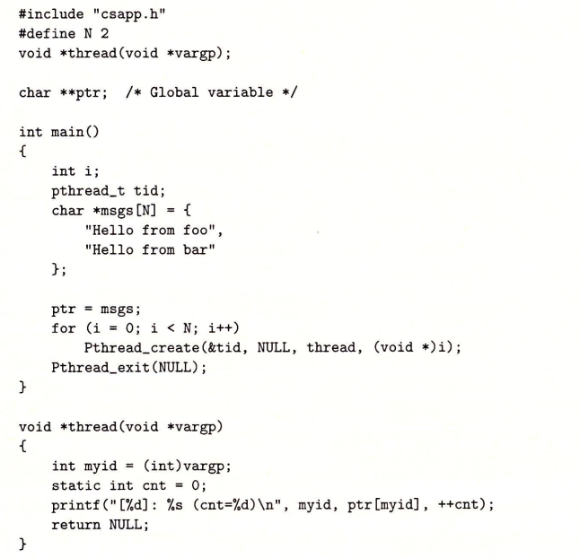

### 将变量映射到内存

多线程的C程序中变量根据它们的存储类型被映射到虚拟内存。

* 全局变量。全局变量是定义在函数之外的变量，在运行时，虚拟内存的读写区域只包含每个全局变量的一个实例，任何线程都可以引用。

* 本地自动变量。本地自动变量就是定义在函数内部但是没有static属性的变量。在运行时，<font color='red'>每个线程的栈都包含它自己的所有本地自动变量的实例，即使多个线程执行同一线程例程也是如此</font>。

* 本地静态变量。本地静态变量，是定义在函数内部并有static属性的变量。和全局变量一样，虚拟内存的读写区域只包含在程序中声明的每个本地静态变量的一个实例。例如，即使每个对等线程都声明了cnt，在运行时虚拟内存的读写区域也只有一个cnt的实例，每个对等线程都读写这个实例。
      

### 共享变量

如果说一个变量v是共享的，当且仅当它的实例被一个以上的线程引用。上图示例程序中变量<font color='red'>cnt是共享的，因为他只有一个运行时实例</font>，并且这个实例被两个对等线程引用，另一方面，<font color='red'>myid不是共享的</font>，因为它的两个事例中每一个都只被一个线程引用，应该认识到msgs这样的本地自动变量也能被共享。

## 用信号量同步线程

共享变量虽然很方便但是会引入同步错误的问题，对于我们而言是没有办法预测操作系统是否将为你的线程选择一个正确的顺序，我们需要借助一种叫作进度图的方法来阐明这些正确或者不正确的指令顺序。

badcnt.c的程序如下：

```c
// 
/* WARING: This code is buggy */  
#include "csapp.h"  

void *thread(void *vargp);  /* thread routine prototype */  

/* globle shared variable */  
volatile long cnt = 0;  /* counter */  

int main(int argc, char **argv)  
{  
    long niters;  
    pthread_t tid1, tid2;  
      
    /* check input argument */  
    if (argc != 2) {  
        printf("usage: %s <niters>\n", argv[0]);  
        exit(0);  
    }  
    niters = atoi(argv[1]);  
      
    /* create threads and wait for them to finish */  
    pthread_create(&tid1, NULL, thread, &niters);  
    pthread_create(&tid2, NULL, thread, &niters);  
    pthread_join(tid1, NULL);  
    pthread_join(tid2, NULL);  
      
    /* check result */  
    if (cnt != (2 * niters))  
        printf("BOOM! cnt = %1d\n", cnt);  
    else  
        printf("OK cnt = %1d\n", cnt);  
    exit(0);  
}  

/* thread routine */  
void *thread(void *vargp)  
{  
    long i, niters = *((long *)vargp);  
      
    for (i = 0; i < niters; i++)  
        cnt++;  
          
    return NULL;  
}  
//
```

运行多次的结果，每一次都会不同。

### 进度图

进度图将n个并发线程的执行模型化为一条n维笛卡尔空间中的轨迹线，每条轴k对应线程k的进度，每个点I，代表线程k已经完成指令Ik这一状态，图的原点对应没有任何线程完成这一条指令的初始状态。我们以H,L,U,S,T为正确的进度顺序。

下图展示了上程序第一次循环的二维进度图，水平轴对应线程1，垂直轴对应线程2，点（L1，S2）对应线程1完成了L1而线程2完成了S2的状态。

 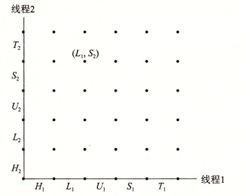

<font color='red'>进度图将指令执行模型化为一种状态到另一种状态的转换，转化被表示为一条从一点到相邻的有向边。</font>合法的转换是向右（线程1中的一条指令完成）或者向上（线程2的一条指令完成）的，两条指令不能再同一时刻完成，对角线转换是不允许，程序绝不会反向运行，所以向下或者向左的转换也不合法，一个程序的执行历史被模型化为状态空间中的一条轨迹线。下图展示了下面的指令对应的轨迹线。

 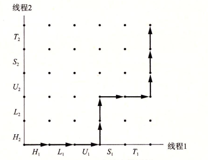

对于线程i，操作共享变量cnt内容的指令（Li，Ui，Si）构成一个关于共享变量cnt的临界区，这个临界区不应该和其他进程的临界区交替执行，换句话说，我们想要确保每个线程在执行它的临界区中的指令时，拥有对共享变量的互斥的访问，这种现象就成为互斥。

在上面的进度图中，两个临界区的交集形成的状态空间区域成为不安全区，下图展示了变量cnt的不安全区，注意，不安全区和他的交界的状态相毗邻，但不包括这些状态，比如上图中（H1，H2）和（S1，U2）毗邻不安全区，但是这些状态并不是不安全的。绕开不安全的轨迹线叫作安全轨迹线，相反接触到任何不安全区的轨迹线叫作不安全轨迹线。<font color='red'>下图展示了安全和不安全轨迹线</font>，任何安全轨迹线都正确地更新共享计数器，为保证线程化程序示例的正确执行（实际上任何共享全局数据结构的并发程序的正确执行）我们必须以某种方式同步线程，使它们总是有一条安全轨迹线，<font color='red'>一个经典的方法是基于信号量的思想。</font>

 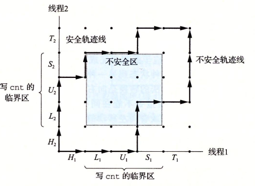

### 信号量

Dijkstra（迪杰斯特拉)并发编程领域的先锋人物，提出了一种经典的解决同步不同执行线程问题的方法，这种方法是基于一种叫做信号量的特殊类型变量。信号量s是具有非负整数值的全局变量，只能由两种特殊的操作来处理，这两种操作成为P和V：

* P（s）：如果s是非0的，那么P将s减1，并立即返回，如果s为0，那么就挂起这个线程，直到s变为非0，而一个V操作会重启这个线程，在重启之后，P操作将s减1，并将控制返回给调用者。

* V（s）：V操作会将s加1，如果有任何线程阻塞在P操作等待s变为非0，那么V操作会重启这些线程中的一个，然后该线程将s减一，完成它的P操作。

P中的测试和减1操作是不可分割的，也就是说如果有任何线程阻塞在P操作等待s变成非0，就会将s减1，不能有中断。

V中的加1操作也是不可分割的，也就是加载、加1和存储信号量的过程没有中断。注意，V的定义中没有定义等待线程被重启动的顺序，唯一的要求是V必须重启一个正在等待的线程，因此当有多个线程在等待同一信号量的时候，不能预测V操作将会重启哪一个线程。

P和V的定义确保一个正在运行的程序绝不可能进入一个状态，也就是一个正确初始化的信号量有一个负值，这个属性成为信号不变性，为控制并发程序的轨迹线提供了强有力的工具。

Posix标准顶一个很多操作信号量的函数：

```c
 #include <semaphore.h>
//若成功为0，出错为-1
//sem ：指向信号量对象
//pshared : 指明信号量的类型。不为0时此信号量在进程间共享，否则只能为当前进程的所有线程共享。
//value : 指定信号量值的大小
int sem_init(sem_t *sem, int pshared, unsigned int value);

int sem_wait(sem_t *sem); /* P(s) */

int sem_post(sem_t *sem); /* V(s) */

sem_init函数将信号量sem初始化为value，每个信号量在使用前必须初始化。针对我们的目的，中间参数总是0，程序分别通过调用sem_wait和sem_post函数执行P和V操作。可以将其包装为函数P、V。
```
### 使用信号量实现互斥
信号量提供了一种很方便的方法来确保对共享变量的互斥访问，基本思想是，<font color='red'>将每个共享变量与一个信号量s联系起来，然后用P（s）和V（s）操作将相应的临界区包围起来。</font>

以这种方式来保护共享变量的信号量叫作<font color='red'>二元信号量</font>，因为它的值总是为0或1，以提供互斥为目的的二元信号量也常常称为互斥锁。在一个互斥锁上执行P操作称为对互斥锁加锁，类似的执行V操作称为对互斥锁解锁。对一个互斥锁加了锁但没有解锁的线程称为占用了这个互斥锁。一个被用作一组可用资源的计数器的信号量被称为计数信号量。下图的进度图展示了我们利用二元信号量来正确的同步计数器程序示例，每个状态都标出了该状态中信号量s的值。关键思想是这种P和V操作的结合创建了一组状态叫作禁止区。其中，s<0。因为信号的不变性，没有实际可行的轨迹线能够包含禁止区中的状态。而且因为禁止区完全包含了不安全区，所以没有实际可行的估计先能够接触不安全区的任何部分，因此每条可行的轨迹线都是安全的。而且不管运行时指令顺序是怎么样的，程序都会正确的增加计数器值。

 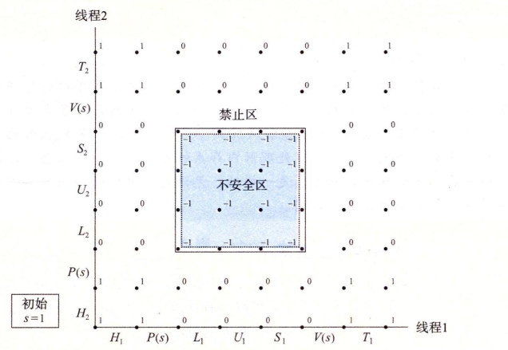

从可操作的意义上来说，由P和V操作创建的禁止区使得在任何时间点上，在被包围的临界区中，不可能有多个线程在执行指令。换句话说，信号量的操作确保了对临界区的互斥访问。

我们可以用信号量正确同步上面程序的计数器，如下程序：

```c
//首先声明一个信号量mutex
volatile long cnt;
sem_t mutex;
//然后在主例程中将其初始化为1
Sem_init*(&mutex,0,1);
//最后在线程例程中对共享变量cnt的更新包围P和V操作，从而保护它们
for(i=0;i<niters;i++){
    P(&mutex);
    cnt++;
    V(&mutex);
}
```

这样，就能每次都产生正确结果了。

进度图也有一定的局限性，将单处理器上的并发程序执行可视化，也能更好的理解同步。然而它也由局限性，尤其是在多处理器上一组CPU、高速缓存对共享一个主存，多处理器的工作方式是进度图不能解释的。但是不管如何，结论是一样的，无论是在单处理器还是多处理器上运行程序都要同步你对共享变量的访问。
### 利用信号量来调度共享资源

除了提供<font color='red'>互斥</font>之外，信号量的另一个作用是<font color='red'>调度对共享资源的访问</font>，在这种场景中，一个线程用信号量操作来通知另一线程，程序中某个条件已经为真了，两个经典而有用的例子就是生产者-消费者和读者-写者问题。    

<font color='red'>1、生产者-消费者问题</font>

下图给出了生产者-消费者问题，生产者消费者线程共享共享一个有n个槽的有限缓冲区，生产者线程反复生成新的项目，并把它们插入缓冲区，消费者线程不断从缓冲区取出这些项目然后消费（使用）它们，也可能有多个生产者消费者的变种。

 

因为插入和取出项目都涉及更新共享变量，所以我们必须保证对缓冲区的访问是互斥的，但是只保证互斥访问是不够的。我们还需要调度对缓冲区的访问，如果缓冲区是满的（没有空的槽位），那么生产者必须等待直到有一个槽位变为可用。相似的，如果缓冲区是空的，消费者必须等待直到有一个项目变为可用。

生产者消费者的相互作用在现实中很普遍，例如在一个多媒体系统中，生产者编码视频帧，消费者解码并在屏幕上呈现出来，缓冲区的目的是为了减少视频流的抖动。

<font color='red'>2、读者-写者问题</font>

读者-写者问题是互斥问题的一个概括，一组并发的线程要访问一个共享对象，例如，一个主存中的数据结构或者一个磁盘上的数据库，有的线程只读对象，而其他的线程只修改对象。修改对象的叫作写者，只读对象的线程叫作读者。写者必须拥有对对象的独占的访问，而读者可以和无线个其他读者共享对象。一般来说，有无线多个并发的读者和写者。

读者-写者交互在现实中也很常见，例如一个在线航空预订系统中，<font color='red'>允许无线多个用户查看座位分配，但是正在预定座位的客户必须拥有对数据库的独占的访问。</font>

读写者问题有几个变种，分别基于读者和写者的优先级。第一类读者-写者问题，读者优先，要求不要让读者等待，除非已经把使用对象的权限赋予了一个写者，换言之，读者不会因为有一个写者在等待而等待。第二类读写者问题，写者优先，要求一旦一个写者准备好可以写，它就会尽可能尽快完成它的写操作。同第一类问题不同，在一个写者后到达的读者必须等待，即使这个写者也在等待。

下图给出一个第一类读者-写者问题的解答。这个解答很微妙。

```c
int readcnt;
sem_t mutex,w;
void reader(void)
{
    while(1){

        P(&mutex);
        readcnt++;
        if(readcnt==1)
          P(&W);
        V(&mutex);
        P(&mutex);
        readcnt--;
        if(readcnt==0)
            V(&w);
         V(&mutex);
    }
}

void writer()
{
    while(1){
        P(&w);
        
        V(&w);
    }
}
```

信号量w控制对访问共享对象的临界区的访问。信号量mutex保护对共享变量readcnt的访问，readcnt统计当前在临界区的读者数量。每当一个写者进入临界区时，对互斥锁w加锁，每当它离开临界区时，对w解锁。这就保证了任意时刻临界区最多只有一个写者。另一方面只有第一个进入临界区的读者对w加锁，而只有最后一个离开临界区的读者对w解锁。当一个读者进入和离开临界区时，如果还有其他读者在临界区时，那么读者就会忽略这个互斥锁。这就意味着，只要还有一个读者没有占用互斥锁w，无限多读者可以没有障碍的进入临界区。对于两种读者-写者问题的正确解答可能导致饥饿（饥饿就是一个线程无限期的阻塞，无法进展），例如上面程序的解答，如果有读者不断到达，写者就可能无限期的等待。

### 综合：基于预线程化的并发服务器

基于称为预线程化技术的并发服务器。在之前基于线程的服务器中，我们为每个新客户创建了一个新线程。这种方法的缺点是，我们为每一个客户端创建一个新线程，导致不小的代价。

一个基于预线程化的服务器试图使用下图所示的生产者消费者模型来降低这种开销。

* 服务器是由一个主线程和一组工作者线程构成的。
* 主线程不断接受来自客户端的连接请求，并将得到的连接描述符放在一个有限缓冲区中。
* 每一个工作者线程反复从共享缓冲区中取出描述符，为客户端服务，然后等待下一个描述符。

 

## 使用线程提高并行性

到现在为止，对并发的研究中，我们假设并发线程都是在单处理器上执行的，然而大多数现代及其都有多核。并发程序通常在这样的机器上运行的更快，因为操作系统内核在多个核上并行的调度这些并发线程，而不是在单个核上顺序的调度。就像Web服务器、数据库服务器和大型科学计算代码这样的应用中利用这样的并行性是至关重要的。
    
下图是顺序、并发和并行程序之间的几何关系，所有程序的集合能够被划分成不相交的顺序集合和并发程序的集合。并行程序是一个运行在多个处理器上的并发程序。

并发（concurrency）和并行（parallellism）是：

1. 解释一：并行是指两个或者多个事件在同一时刻发生；而并发是指两个或多个事件在同一时间间隔发生。
2. 解释二：并行是在不同实体上的多个事件，并发是在同一实体上的多个事件。
3. 解释三：并行是在多台处理器上同时处理多个任务。如 hadoop 分布式集群，并发是在一台处理器上“同时”处理多个任务。

所以并发编程的目标是充分的利用处理器的每一个核，以达到最高的处理性能。

 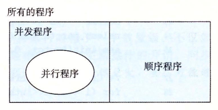

并行程序的详细处理超过我们需要讨论的。但是研究一个非常简单的示例程序能够帮助你理解并行编码的一些重要的方面，例如我们如何并行的对一列整数0,1,2.....，n-1求和，我们不使用现有的公式。将任务分配到不同线程的最直接方法就是将序列划分成t个不相交的区域，然后给t个不同的线程每个分配一个区域，为了简单假设n是t的倍数，这样每个区域都有n/t个元素。

最简单也是最直接的选择是将线程的和放入一个共享的全局变量，用互斥锁保护这个变量。下图中实现了这个方法。在第28~33行，主线程创建对等线程，然后等待他们结束。注意主线程传递给每个对等线程一个小整数，座位唯一的线程ID，每个对等线程会用它的线程ID来决定它应该计算序列的哪一部分，这个向对等线程传递一个小的唯一的线程ID的思想是一项通用技术，许多并行应用中都用到了它。在对等线程终止后，全局变量gsum包含着最终和，然后主线程用闭合形式解答来验证结果。

 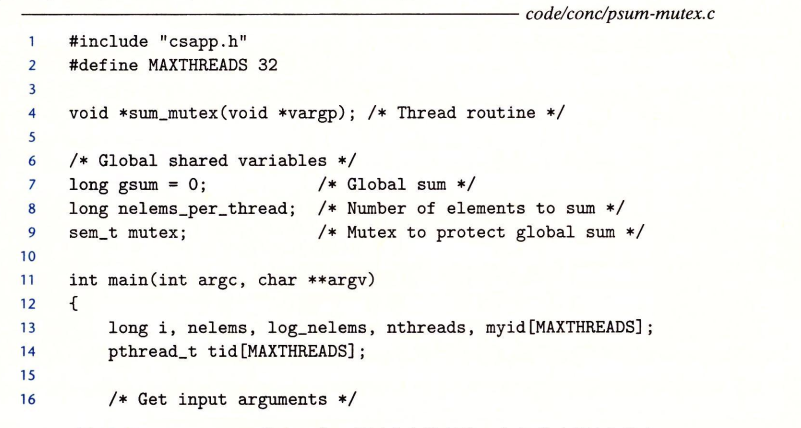

 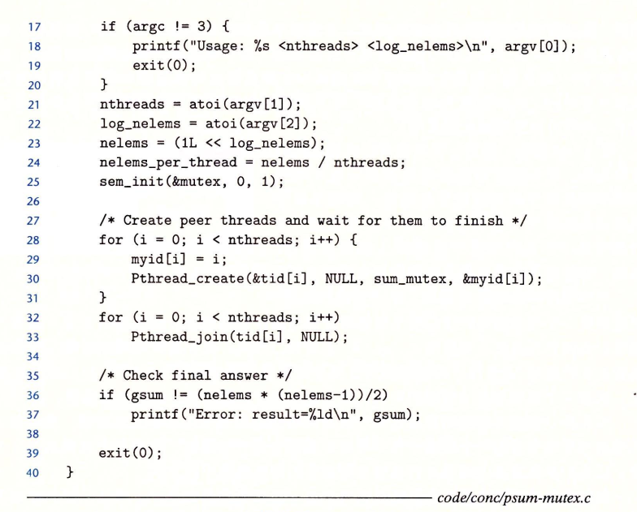

下图给出每个对等线程执行的函数，第4行中，线程从线程参数中提取线程ID，然后用这个ID来决定他要计算的序列区域（5-6），第9-13行线程在它的那部分序列上迭代操作，每次迭代都更新共享全局变量gsum。用P和V互斥操作保护每次更新。

 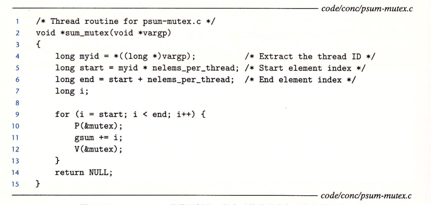

我们在一个四核系统上，对一个大小为n=2^31的序列运行psum-mutex，测量它的运行时间，得到的结果比较奇怪也比较难懂。

  

程序单线程顺序运行时非常慢，几乎比多线程并行时慢了一个数量级。不仅如此使用的核数越多，性能越差。造成性能差的原因是相对于内存更新操作的开销，同步操作（P和V）代价太大。这凸显了并行编程一个重要的教训：<font color='red'>同步开销巨大，要尽可能避免，如果无法避免，必须要用尽可能多的有用的计算弥补这个开销。</font>

在我们的例子中，一种避免同步的方法就是<font color='red'>让每一个对等线程在一个私有变量中计算它自己的部分和</font>，这个私有变量不与其他任何线程共享，如下图所示。主线程定义一个全局数组psum，每个对等线程i把他的部分和累积在psum[i]中,因为小心的给了每个对等线程一个不同的内存位置来更新，所以不需要用互斥锁来保护这些更新，唯一需要同步的地方是主线程不必须等待所有子线程完成，主线程把psum向量的元素加起来，得到最终结果。

 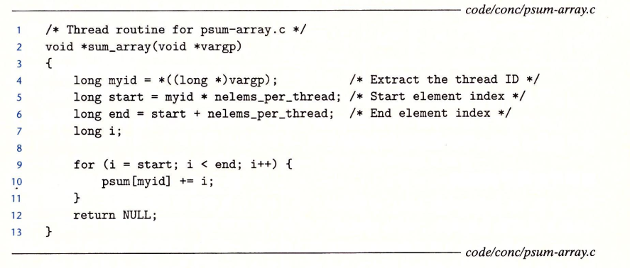

在四核系统上运行上面的程序可以看到比之前的快了很多。

 

在之前我们了解，可以<font color='red'>使用局部变量来消除不必要的内存引用</font>，下图展现了如何应用这项原则，让每个对等线程把它的部分和累积在一个局部变量而不是全局变量。

 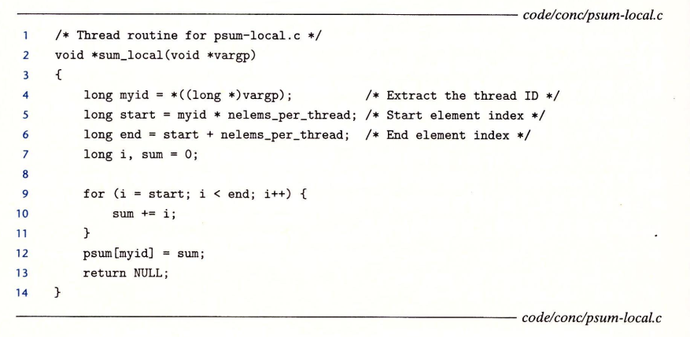

这样得到新的运行时间为：

 

由此可以看来，并行程序很难，代码一点小的改动可能会对性能有极大的影响。

## 其他并发问题

也许你已经注意到，一旦我们要求同步对共享数据的访问，那么事情就变得复杂，迄今为止，我们已经看到用于互斥和生产者-消费者同步的技术，同步从根本上说是很难的问题，它会引出在普通的顺序程序中不会存在的问题。这一节以线程为例，具体讨论，但是这些问题是任何类型的并发流操作共享资源时都会出现。

### 线程安全

当用线程编写程序时，必须小心地编写那些具有称为线程安全性属性的函数，一个函数被称为线程安全的，当且仅当被多个并发线程反复调用时，它会一直产生正确的结果。如果一个函数不是线程安全的，我们就说它是线程不安全的。

我们能够定义出四个（不相交）线程不安全函数类：

1. <font color='red'>不保护共享变量的函数。</font>在前面程序中见过这样的函数，函数对一个未受保护的全局计数器变量加1。将这类线程不安全函数变成线程安全还算比较简单，利用像P和V操作这样的同步操作来保护共享变量。这个方法的优点是在调用程序中不需要做任何修改。缺点是同步操作将减慢程序的执行时间。

2. <font color='red'>保持跨越多个调用状态的函数。</font>一个伪随机数生成器是这类线程不安全函数的简单例子。参考下图的伪随机数生成器程序包，rand函数是线程不安全。因为当前调用的结果依赖于前次调用的中间结果，当调用srand为rand设置了一个种子后，我们从一个单线程中反复的调用rand，能够预期得到一个可重复的随机数字序列。但是如果多线程调用rand函数这种假设就不成立了。使得像rand这样的函数线程安全的唯一方式是重写它，使它不再使用任何static数据，而是依靠调用者在参数中传递状态信息。这样的缺点是，程序员还要被迫修改调用程序中的代码，但是在一个大的程序中可能有很多调用位置，这样的修改显然是非常麻烦的。

3. <font color='red'>返回指向静态变量的指针的函数。</font>某些函数，例如ctime和gethostbyname将计算结果放在一个static变量中，然后返回一个指向这个变量的指针，如果我们从并发线程中调用这些函数就可能发生灾难。因为正在被一个线程使用的结果会被另一个线程覆盖。有两种方法来处理这类线程不安全函数，一是选择重写函数，使得调用者传递存放结果的变量的地址，这就消除了所有共享数据，但是这样要求程序员能够修改函数源代码。如果线程不安全函数是难以修改或不可能修改的，那么另外一种选择就是使用加锁-复制技术。基本思想是将线程不安全函数与互斥锁联系起来，在每一个调用位置，对互斥锁加锁，调用线程不安全函数，将函数返回结果复制到一个私有的内存位置，然后对互斥锁解锁。为了尽可能减少对调用着的修改，你应该定一个线程安全的包装函数，它执行加锁复制，然后通过调用这个包装函数来取代所有对线程不安全函数的调用。

4. <font color='red'>调用线程不安全函数的函数。</font>如果函数f调用线程不安全函数g，那么f就是线程不安全的吗，不一定，如果g是第2类函数，也就是依赖于跨越多次调用的状态，那么f也是线程不安全的。而且除了重写g以外没有什么办法。如果g是第一类或者第三类函数，那么你只需要一个互斥锁保护调用位置和任何得到的共享数据，f仍然可能是线程安全的。上图就是一个很好地例子。使用加锁-复制编写了一个线程安全函数，它调用了一个线程不安全函数。

### 可重入性

有一类重要的线程安全函数，叫作可重入线程安全函数，其特点是，<font color='red'>当它们被多个线程调用时，不会引入任何共享数据。</font>尽管线程安全和可重入有时会被当做同义词但是还是有清晰地技术差别。可重入函数集合是线程安全函数的一个真子集。

可重入函数通常比不可重入的线程安全函数高效一些，因为它们不需要同步操作。将第二类线程不安全函数转化为线程安全函数的唯一方法就是重写，使其变成可重入。下图是rand函数的一个可重入版本。关键思想是我们用一个调用者传递进来的指针取代了静态的next变量。

 

可重入可以分为显式可重入（所有函数参数都是传值传递，所有数据引用都是本地自动栈变量，没有引用静态或全局变量），隐式可重入（允许一些参数是引用传递，如果调用线程指向非共享数据的指针）。意识到，可重入性有时既是调用者也是被调用者的属性，并不单单是被调用者的属性。
    
### 在线程化的程序中使用已存在的库函数

大部分linux函数，包括定义在标准C库中的函数都是线程安全的，只有一小部分例外。见下图。

 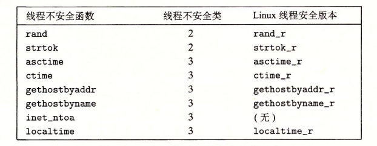

其中strok函数已经弃用。asctime、ctime和localtime函数是在不同时间和数据格式之间转换经常使用的函数。gethostbyname、gethostbyaddr和inet_ntoa函数已经弃用。被可重入的getaddrinfo、getnameinfo和inet_ntop函数取代。除了rand和strtok以外，所有线程不安全函数都是第三类，他们返回一个指向静态变量的指针。如果我们要在一个线程化的程序中调用这些函数最容易的就是加锁-复制。然而加锁-复制也有很多缺点。首先，额外的同步降低了程序的速度，第二，像gethostbyname这样的函数返回指向复杂结构的结构的指针，要复制整个结构层次需要深层复制。第三，加锁-复制方法对rand这样依赖跨越调用的静态状态的第2类函数并不有效。linux提供大多数线程不安全的函数的线程安全版本，可重入版本的名字总是以“_r”后缀结尾。

### 竞争

当一个程序的正确性依赖于一个线程要在另一个线程到达y点之前到达它的控制流中的x点时，就会发生竞争。通常发生竞争是因为程序员假定线程将按照某种特殊的轨迹线穿过执行状态空间，而忘记另一条准则规定：<font color='red'>多线程的程序必须对任何可行的轨迹线都正确工作。</font>

下面是一个简单的例子。如下图程序，主线程创建了四个对等线程，并传递一个指向一个唯一的整数ID的指针到每个线程，每个对等线程复制它的参数中传递的ID得到一个局部变量中，然后输出一个包含这个ID的信息。看上去这个程序没什么问题，但是当我们在系统上运行时，却得到一个不正确的结果。

 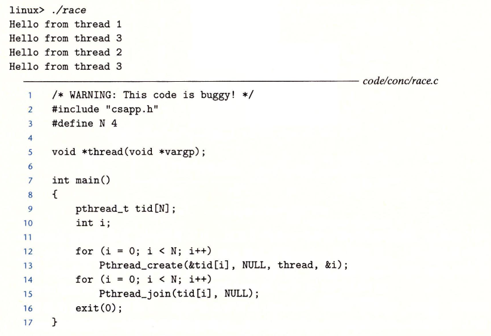

 

问题是由每个对等线程和主线程之间的竞争引起的。当主线程在13行创建一个对等线程，它传递了一个指向本地栈变量i的指针，在此时，竞争出现在下一次在12行对i加1之前执行了第22行，那么myid变量就得到正确的ID，否则它包含的就会是其他线程的ID。这个错误有可能不会出现，结果也有可能会是正确的，很难察觉到程序的错误。即<font color='red'>能否得到正确的答案依赖于内核是如何调度线程执行的。</font>

为了消除竞争，可以动态的为每个整数ID分配一个独立的块，并且传递给线程例程一个指向这个块的指针。如下图所示，注意线程必须释放这些块以避免内存泄漏。这样就会得到正确的结果。

 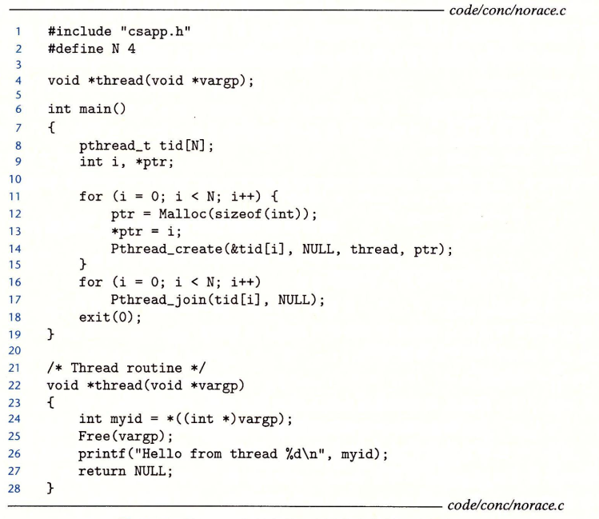

当在系统上运行该程序，得到正确的结果：

 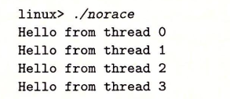

### 死锁

信号量引入了一个潜在的运行错误，叫作死锁。它指的是一组线程被阻塞了，等待一个永远不会为真的条件。进度图对于理解死锁是一个很好的工具。下图展示了一对用两个信号量实现互斥的线程的进度图，从这幅图中，我们能得到一些关于死锁的重要的知识。

 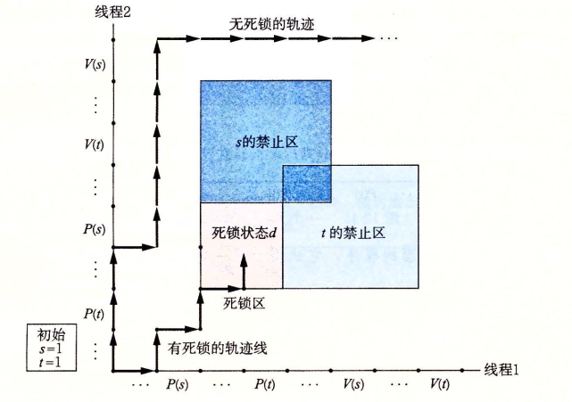

* 程序员使用P和V操作顺序不当，以至于两个信号量的禁止区域重叠，如果某个执行轨迹线碰巧到达了死锁状态d，那么就不可能有进一步的进展了，因为重叠的禁止区域阻塞了每个合法向上的进展，换句话说，程序死锁是因为每个线程都在等待其他线程执行一个根本不可能发生的V操作。

* 重叠的禁止区域引起了一组称为死锁区域的状态，如果一个轨迹线碰巧到达了一个死锁区域的状态，那么死锁就不能避免了，轨迹线可以进入死锁区域，但不可能离开。

* 死锁是一个相当困难的问题，因为它不总是可预测的。一些幸运的执行轨迹线将绕开死锁区域，而其他的将会陷入这个区域，上图展示了每种情况的一个示例，对程序员来说，其中隐含的错误很糟糕，因为它可能运行1000次都不出错，但是下一次就出错，也有可能在一台机器上很好，在另一台就有问题。并且错误还是不可重复的，因为不同的执行有不同的轨迹线。

程序死锁的原因有很多，要避免死锁一般而言是困难的，但是当使用二元信号量来实现互斥时，如下图所示，你可以应用下面的简单而有效的规则避免死锁。

 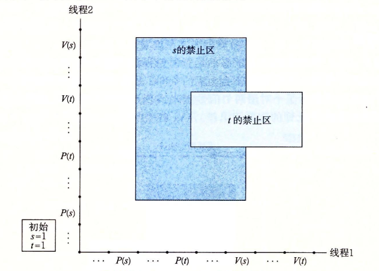

互斥锁加锁的顺序规则：<font color='red'>给所有的互斥操作的一个全序，如果每个线程都是以一种顺序获得互斥锁并以相反的顺序释放，那么这个程序就是无锁。</font>

例如我们可以通过这样的方法来解决上图中的死锁问题：在每个线程中先对s加锁，然后再对t加锁。这样就得到下面的进度图：

## 小结

一个并发程序是由在时间上重叠的一组逻辑流组成的。在这一章中，我们学习了三种不同的构建并发程序的机制:<font color='red'>**进程、IO多路复用和线程**</font>。

1. 进程是由内核自动调度的，而且因为它们有各自独立的虚拟地址空间，所以要实现共享数据，必须要有显式的IPC机制。事件驱动程序创建它们自己的并发逻辑流，这些逻辑流被模型化状态机，用IO多路复用来显式的调度这些流，因为程序运行在单一进程中，所以在流之间共享数据速度很快而且很容易。线程是这些方法的混合，同基于进程的流一样，线程也是由内核自动调度的，同基于IO多路复用的流一样，线程是运行在单一进程的上下文中的，因此可以快速方便的共享数据。

2. 无论哪种并发机制，同步对共享数据的并发访问都是比较困难的，提出信号量的P和V操作就是为了帮助解决这个问题。信号量操作可以用来提供对共享数据的互斥访问，也对比如生产者-消费者程序中有限缓冲区和读写者系统中的共享对象这样的资源访问进行调度。

3. 并发也引入了其他一些困难的问题，被线程调用的函数必须具有一种称为线程安全的属性。我们定义了四种不同种类的线程不安全函数，以及一些将它们变为线程安全的建议。可重入函数是线程安全函数的一个真子集，它不访问任何共享数据。可重入函数比不可重入函数更高效，因为它们不涉及任何同步操作。竞争和死锁是并发程序中出现的另一些困难问题，当程序员错误的假设逻辑流如何调度时，就会发生竞争，当一个流等待一个永远不会发生的事件时，就会产生死锁。
