# 深入理解计算机系统——第6章 存储器层次结构

# 参考资料

* [《深入理解计算机系统》学习笔记整理（CSAPP 学习笔记）](https://www.cnblogs.com/xsqblogs/p/14688428.html)

# 存储器层次结构
概念：多个<font color='red'>**具有不同容量、成本和访问时间**</font>。的存储设备构成了存储器层次结构，称为存储器系统。

执行指令时访问数据所需的周期数：

CPU寄存器：0个周期
L1~L3高速缓存：4~75个周期
主存：上百个周期
磁盘：几千万个周期

因为访问数据在各个存储器层次中的所需时间差异，促使使用者理解数据是如何在存储器层次结构中上下移动的，这样编写应用程序时，使得它们的数据项存储在层次结构较高的地方，CPU就能更快地访问。

## 存储技术
几种基本的存储技术：

1. 随机访问存储器(RAM)，分为两类,SRAM比DRAM更快：
   1. SRAM：静态随机访问存储器，速度快，价格高。多用来作为高速缓存存储器。
   2. DRAM：动态随机访问存储器，速度慢，价格低。多用来作为主存和图形系统的帧缓冲器
2. ROM，同时也是非易失性存储器。闪存属于 ROM，固态硬盘就是基于闪存开发而来。
3. 机械硬盘
4. 固态硬盘

## 随机访问存储器
###  SRAM
SRAM 将每个位存储在一个双稳态的存储器单元内。每个单元由六个晶体管电路来实现的。

对于 SRAM，只要有双双稳态即该电路无限期地稳定保持在两个不同的电压状态。只要有电，就永远地保持它的值。即使有干扰，当干扰消除，电路也会恢复到稳定值。
###  DRAM
DRAM 将每个位存储为对一个电容的充电。每个 DRAM 单元由一个电容和一个访问晶体管组成。
DRAM 对干扰非常敏感。当电容的电压被扰乱后，就永远不会恢复了。

### SRAM 与 DRAM 比较

只要有供电，SRAM就会保持不变，与DRAM不同，它不需要刷新。SRAM的存取比DRAM快。SRAM对诸如光和电噪声这样的干扰不敏感。代价是SRAM单元比DRAM单元使用更多的晶体管，因而密集度低，而且更贵，功耗更大。


### 传统的 DRAM
DRAM 芯片被分为 d 个超单元，每个超单元包含 w 个 DRAM 单元，w 一般为 8。当从 DRAM 中读取数据时，一次可以读取一个超单元的数据（可以近似的将超单元理解为一个字节）。

一个16X8的DRAM芯片的组织结构体如下：

 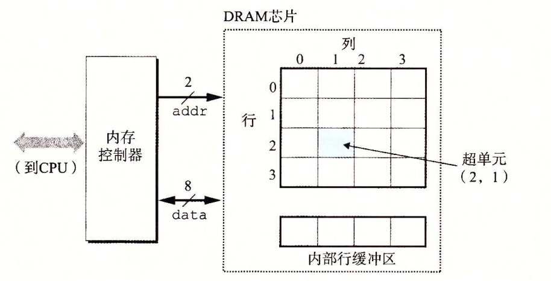

DRAM 中的超单元按行列组织，DRAM 中还包含一个行缓冲区。
内存控制器依次将行地址和列地址发送给 DRAM，DRAM 将对应的超单元的内容发回给内存控制器以实现读取数据。
**行地址和列地址共享相同的 DRAM 芯片地址引脚。**
从 DRAM 中读取超单元的步骤：
内存控制器发来行地址 i，DRAM 将整个第 i 行复制到内部的行缓冲区。
内存控制器发来列地址 i，DRAM 从行缓冲区中复制出超单元 (i,j) 并发送给内存控制器。

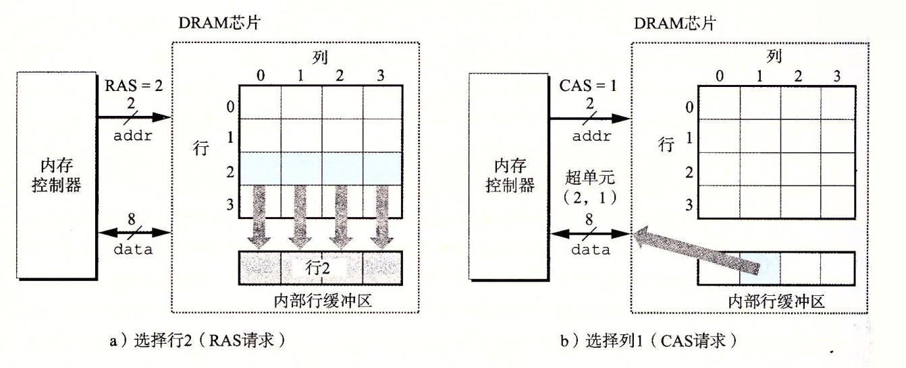

电路设计者将DRAM组织成二维阵列而不是线性数组的一个原因是降低芯片上地址引脚的数量。例如，128位DRAM被组织成一个16个超单元的线性数组，地址为0-15，那么芯片会需要4个地址引脚而不是2个。二维阵列组织的缺点是必须分两步发送地址，这增加了访问时间。

## 内存模块
许多 DRAM 芯片封装在内存模块中，插到主板的扩展槽上。
常用的是双列直插内存模块 (DIMM)，以 64 位为块与内存控制器交换数据。
比如，一个内存模块包含 8 个 DRAM 芯片，每个 DRAM 包含 8M 个超单元，每个超单元存储一个字节。**使用 8 个 DRAM 芯片上相同地址处的超单元来表示一个 64 位字**，DRAM 0 存储第一个字节，DRAM 1 存储第 2 个字节，依此类推。
要取出内存地址 A 处的一个字，内存控制器先将 A 转换为一个超单元地址 (i,j)，然后内存模块将 i,j 广播到每个 DRAM。作为响应，每个 DRAM 输出它的 (i,j) 超单元的 8 位内容，合并成一个 64 位字，再返回给内存控制器。

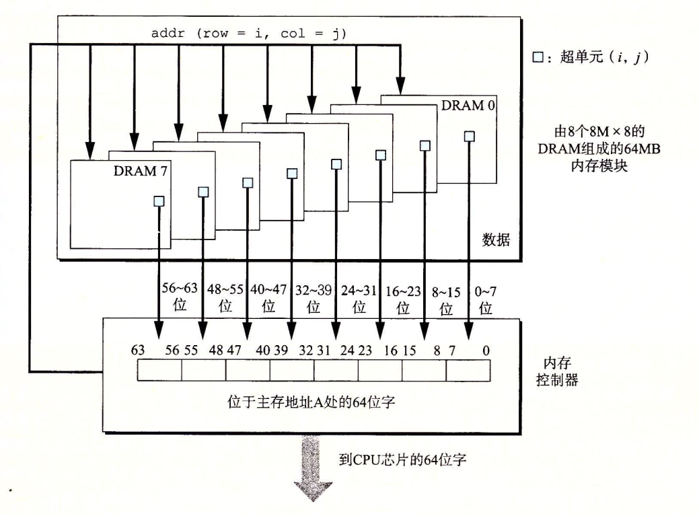

主存由多个内存模块连接到内存控制器聚合成。

## 增强的 DRAM
有一些经过优化的 DRAM：

1. 快页模式 DRAM (FPM DRAM)：当连续访问位于同一行的超单元时，第二次以后，FPM DRAM 可以直接从行缓冲区获取数据。
2. 扩展数据输出 DRAM (EDO DRAM)：FPM DRAM 的一个增强的形式，更快一些。
3. 同步 DRAM (SDRAM)：常规的、FPM 和 EDO 都是异步的。从效果而言，SDRAM 可以比异步存储器更快地输出它的超单元的内容。 
4. 双倍数据速率同步 DRAM(DDR SDRAM)：对 SDRAM 的一种增强，使速度翻倍。不同的 DDR SDRAM 以提高有效带宽的很小的预留缓冲区的大小来划分：DDR(2位)、DDR2(4位)、DDR3(8位)。位越多速度越快，近乎翻倍。
5. 视频 RAM (VRAM)：用在图形系统的帧缓冲区中，其思想与 FPM DRAM 类似。VRAM 允许对内存进行并行地读和写。因此系统可以在写下一次更新的新值时（写），用帧缓冲区的像素刷屏幕（读）。

现在计算机使用的大多数都是 DDR3 SDRAM。

## 非易失性存储器

DRAM 和 SRAM 会在断电后丢失信息，因此是易失性存储器。ROM 是非易失性存储器，在断电后仍保存着信息。
ROM 是只读存储器，但是实际上有些 ROM 既可以读也可以写。

几种常见的非易失性存储器：

1. 可编程 ROM (PROM)：只能被编程一次。
2. 可擦写可编程 ROM (EPROM)：可以被擦除和重编程上千次。
3. 电子可擦除 PROM (EEPROM)：类似于 EPROM，但是可以被重编程十万次。
4. 闪存：基于 EEPROM 的一种存储技术。闪存无处不在，固态硬盘就是一种基于闪存的磁盘驱动器。

存储在 ROM 设备中的程序通常称为固件，当计算机系统通电后，会运行存储在 ROM 中的固件。

## 访问主存

数据流通过总线在处理器与主存间来往，每次处理器和主存间的数据传送的一系列步骤称为总线事务。

总线是一组并行的导线，能携带地址、数据和控制信号。

系统总线连接 CPU 和 IO 桥接器，内存总线连接 IO 桥接器和主存。IO 桥同时也连接着 I/O 总线。

 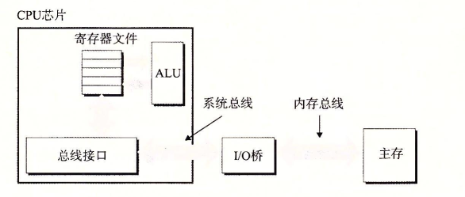

读事务的三个步骤：

1. CPU 将地址 A 放到内存总线上。
2. 主存从总线读出 A，取出字 x，然后将 x 放到总线上。
3. CPU 从总线读出字 x，并将它复制到相应寄存器中。

写事务的三个步骤：

1. CPU 将地址 A 放到内存总线。主存读出这个地址，并等待数据字。
2. CPU 将数据字 y 放到总线上。
3. 主存从总线读数据字 y，并将它存储在地址 A。

## 磁盘存储

### 磁盘构造
磁盘由盘片组成，每个盘片有两个表面，表面上覆盖着磁性记录材料。一个磁盘包含一个或多个盘片。
盘片以固定速率旋转，通常为 5400~15000，单位是转每分钟 (RPM)。
每个表面由多个同心圆（称为磁道）组成，每个磁道被划分为一组扇区，每个扇区包含相同的数据位（一般为512字节）。
扇区之间由间隙分隔开，间隙中不存储数据位，而存储用来标识扇区的格式化位。
名词柱面用来表示距离主轴相等的磁道的集合。比如一个磁盘有 3 个盘片，那么每个柱面就有 6 个磁道。

 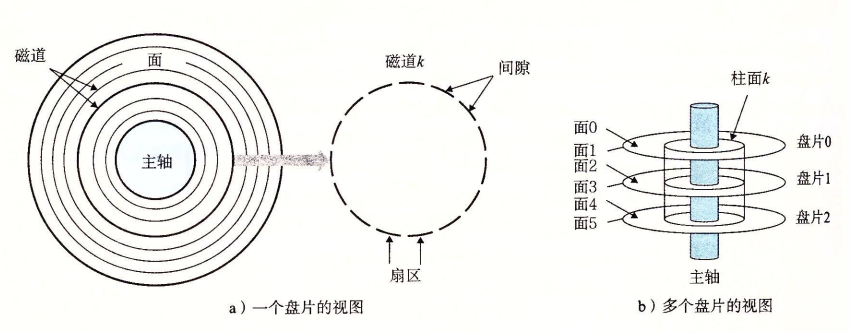

###  磁盘容量
决定磁盘容量的因素：

* 记录密度：磁道一英寸的段中可以放入的位数。
* 磁道密度：从盘片中心出发半径上一英寸的段内可以有的磁道数。
* 面密度：记录密度与磁道密度的乘积。

磁盘容量公式：

 

DRAM 和 SRAM 相关的单位中 K = 2^10，磁盘、网络、速率、吞吐量相关的单位中 K=10^3。
注：磁盘格式化会填写间隙、标识出有故障的柱面、在每个区中预留出一组柱面作为备用。所以格式化容量要比最大容量小。

### 磁盘操作

磁盘用读写头来读写存储在磁性表面的位。每个表面都有一个读写头，任何时候所有的读写头都位于同一个柱面上。
读写头位于传动壁的末端，读写头的速度约为 80km/h，距磁盘表面约 1um，因此磁盘是很脆弱的，开机时不要挪动主机更不要拍主机。
磁盘读写数据时以扇区为单位，即一次读写一个扇区大小的块。
对扇区的访问时间包括三部分：

* 寻道时间：为了读取目标扇区的内容，传动臂首先要将读写头定位到包含目标扇区的磁道上。

  * 现代驱动器的平均寻道时间为 3~9 ms，最大为 20 ms。

* 旋转时间：读写头定位到期望的磁道后，要等待目标扇区的第一个位旋转到读写头下。

  * 旋转时间依赖于磁盘的旋转速度和读写头到达目标磁道时的位置。
  * 最大旋转时间是旋转速度的倒数，平均旋转时间是最大旋转时间的一半。

* 传送时间：平均传送时间是读写头读写完整个扇区的时间。

  * 传送时间依赖于磁盘的旋转速度和每条磁道的扇区数目。


旋转时间一般和寻道时间差不多，而传送时间相对可以忽略不计，因此从磁盘读取一个扇区的时间约为 10 ms。

## 逻辑磁盘块

    现代磁盘呈现为一个逻辑块的序列，每个逻辑块大小为一个扇区，即 512 字节。
    当操作系统读写磁盘时，发送一个逻辑块号到磁盘控制器，控制器上的固件将逻辑块号翻译为一个（盘面、磁道、扇区）的三元组。

## 连接 I/O 设备

系统总线与内存总线都是与 CPU 相关的，而 IO 总线与 CPU 无关。Intel 的外部设备互连总线（PCI）就是一种 IO 总线。
IO 总线速度相比于系统总线和内存总线慢，但是可以容纳种类繁多的第三方 IO 设备。

连接到 IO 总线的三种设备：

* 通用串行总线（USB）：USB 总线是一个广泛使用的标准，连接各种 IO 设备，包括键盘、鼠标等。
* 显卡/显示适配器：负责代表 CPU 在显示器上画像素。
* 主机总线适配器：连接磁盘。常总的磁盘接口是 SCSI 和 SATA。其中 SCSI 比 SATA 更快也更贵。

 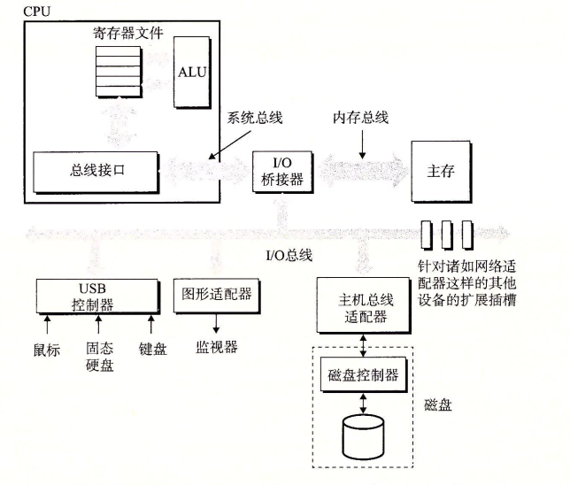

6、访问磁盘
CPU 使用内存映射 IO 技术来向 IO 设备发射命令。在使用内存映射 IO 的系统中，地址空间中有一块地址是专为与 IO 设备通信保留的，每个这样的地址称为一个 IO 端口。当一个设备连接到总线时，它与一个或多个端口相关联。

假设磁盘控制器映射到端口 0xa0，读一个磁盘扇区的步骤如下：
CPU 依次发送命令字、逻辑块号、目的内存地址到 0xa0，发起一个磁盘读。因为磁盘读的时间很长，所以此后 CPU 会转去执行其他工作。
磁盘收到读命令后，将逻辑块号翻译成一个扇区地址，读取该扇区的内容，并将内容直接传送到主存，不需要经过 CPU (这称为直接内存访问(DMA))。
DMA 传送完成后，即磁盘扇区的内容安全地存储在主存中后，磁盘控制器给 CPU 发送一个中断信号来通知 CPU。

CPU从磁盘读取数据：

 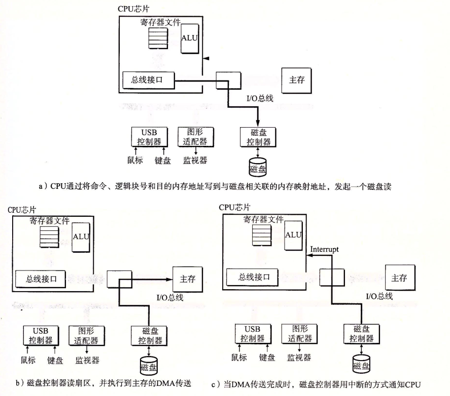

##  固态硬盘
固态硬盘 (Solid State Disk，SSD) 是一种基于闪存的存储技术。
一个固态硬盘中封装了一个闪存翻译层和多个闪存芯片。闪存翻译层是一个硬件/固件设备，功能类似磁盘控制器，将对逻辑块的请求翻译成对底层物理设备的访问。

  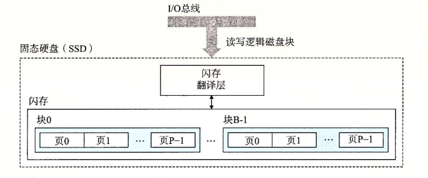

一个闪存由 B 个块的序列组成，每个块由 P 页组成，页的大小为 512byte~4kb。数据以页为单位进行读写。
对于 SSD 来说，读比写快。因为只有在一页所属的块整个被擦除后，才能写这一页。重复写十万次后，块就会磨损，因此固态硬盘寿命较低。
随机写 SSD 很慢的两个原因：

* 擦除块需要相对较长的时间。
* 如果写操作试图修改一个已经有数据的页，那么这个块中所有带有用数据的页都必须复制到一个新的块，然后才能向该页写数据。

SSD 相比于旋转磁盘的优点：由半导体存储器构成，没有移动部件，所以更结实，随机访问也更快，能耗更低。
缺点：更容易磨损，不过现在的 SSD 已经可以用很多年了。

## 存储技术趋势
性能上：SRAM > DRAM > SSD > 旋转磁盘
发展速度上：增加密度(降低成本) > 降低访问时间
DRAM 和 磁盘的性能滞后于 CPU 的性能提升速度，两者之间的差距越来越大。

# 局部性

局部性是程序的一个基本属性。具有良好局部性的程序倾向于重复地访问相同的数据 (时间局部性)，或倾向于访问邻近的数据 (空间局部性)，因此运行更快。

局部性有两种形式：**时间局部性和空间局部性**。

程序员应该理解局部性原理，因为一般而言，有良好局部性的程序比局部性差的程序运行得更快。现代计算机系统的各个层次，从硬件到操作系统，到应用程序，它们的设计都利用了局部性。

* 在硬件层，局部性原理允许计算机设计者通过引入成为高速缓存存储器的小而快速的存储器来保存最近被引用的指令和数据项，从而提高对主存的访问速度。
* 在操作系统级，局部性原理允许系统使用主存作为虚拟地址空间最近被引用的高速缓存。类似地，操作系统用主存来缓存磁盘文件系统中最近被使用的磁盘块。
* 在应用程序，例如，Web浏览器将最近被引用的文档放在本地磁盘上，利用的就是时间局部性。大量的Web服务器将最近被请求的文档放在前端磁盘高速缓存中，这些缓存能满足对这些文档的请求，而不需要服务器的任何干涉

## 对程序数据引用的局部性
```c++
int sumvec(int v[N])
{
  int i = 0, sum = 0;
  for(i=0; i<N; i++)
  {
     sum += v[i];      
   }        
   return sum;
}
```

上例中，sum 具有好的时间局部性，向量 v 具有好的空间局部性。
这里对向量 v 中元素的访问是顺序访问的，称为步长为 1 的引用模式。在空间局部性上，步长为 1 的引用模式是最好的。

##  取指令的局部性
程序指令存放在内存中，CPU 需要读这些指令，因此取指令也有局部性。比如 for 循环中的指令具有好的时间局部性和空间局部性。

## 局部性小结
* 重复引用相同变量的程序有好的时间局部性。
* 对于步长为 k 的引用模式的程序，k 越小，空间局部性越好。
* 对于取指令来说，循环有好的时间和空间局部性。循环体越小，循环迭代次数越多，局部性越好。

# 存储器层次结构

存储技术：不同存储技术的访问时间差异很大。速度较快的技术每字节的成本要比速度较慢的技术高，而且容量较小。CPU和主存之间的速度差距在增大。

计算机软件：一个编写良好的程序更倾向于展示良好的局部性。

典型的存储器层次结构：

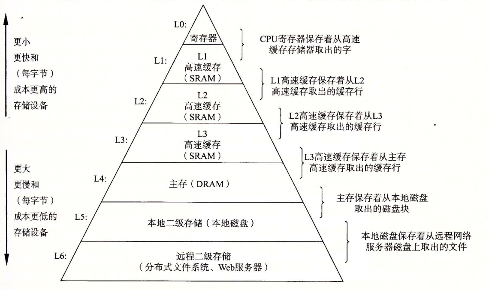

## 存储器层次结构中的缓存
存储器层次结构的核心思想：第 k 层作为第 k+1 层存储设备的缓存。

缓存的具体实现：第 k+1 层的存储器被划分为连续的块，每个块有唯一的地址或名字。第 k 层的存储器被划分为较少的块的集合，每个块的大小与 k+1 层的块大小一样。数据以块为传输单元在不同层之间复制。

层次结构中更低的层，因为访问时间更长，为了补偿访问时间，使用的块更大。

**缓存命中**

当需要 k+1 层的某个数据对象 d 时，如果 d 恰好缓存在 k 层中，就称为缓存命中。

**缓存不命中**
缓存不命中时，第 k 层的缓存从 第 k+1 层缓存中取出包含 d 的块。
如果第 k 层缓存已经满了，需要根据替换策略选择一个块进行覆盖 (替换)，未满的话需要根据放置策略来选择一个块放置。

**缓存不命中的种类**

* 冷不命中：一个空的缓存称为冷缓存，冷缓存必然不命中，称为冷不命中。
* 冲突不命中：常用的放置策略是将 k+1 层的某个块限制放置在 k 层块的一个小的子集中。比如 k+1 层的块 1,5,9,13 映射到 k 层的块 0。这会带来冲突不命中。
* 容量不命中：当访问的工作集的大小超过缓存的大小时，会发生容量不命中。即缓存太小了，不能缓存整个工作集。

**缓存管理**

寄存器文件的缓存由编译器管理，L1,L2,L3 的缓存由内置在缓存中的硬件逻辑管理，DRAM 主存作为缓存由操作系统和 CPU 上的地址翻译硬件共同管理。

# 高速缓存存储器

L1 高速缓存的访问速度约为 4 个时钟周期，L2 约 10 个周期，L3 约 50 个周期。

当 CPU 执行一条读内存字 w 的指令，它首先向 L1 高速缓存请求这个字，如果 L1 没有就向 L2，依此而下。

## 通用的高速缓存存储器组织结构
假设一个计算机系统中的存储器地址有 m 位，形成 M =2^m 个不同的地址。m 个地址为划分为 t 个标记位，s 个组索引位，b 个块偏移位。

高速缓存被组织成 S=2^s 个高速缓存组，每个组包含 E 个高速缓存行，每个行为一个数据块，包含一个有效位，t=m-(b+s) 个标记位，和 B=2^b 字节的数据块。高速缓存的容量 = S * E * B。高速缓存可以通过简单地检查地址位来找到所请求的字。

 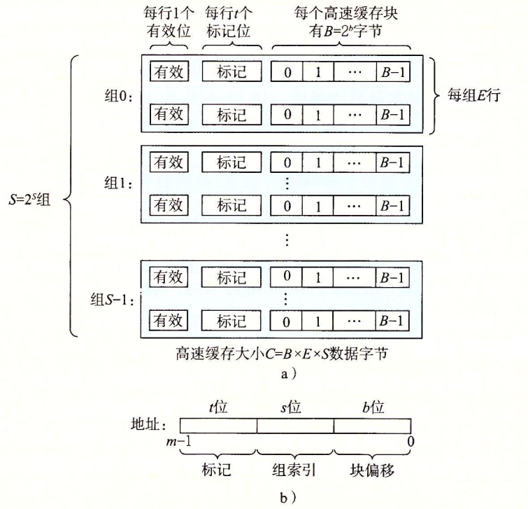

当 CPU 要从地址 A(由m个地址位组成) 处读一个字时：

* A 中的 s 个组索引位告诉我们在哪个组中
* A 中的 t 个标记位告诉我们在这个组中的哪一行：当且仅当这一行设置了有效位并且标记位与 A 中的标记位匹配时，才说明这一行包含这个字。
* A 中的 b 个块偏移位告诉我们在 B 个字节的数据块中的字偏移。

高速缓存参数标识：

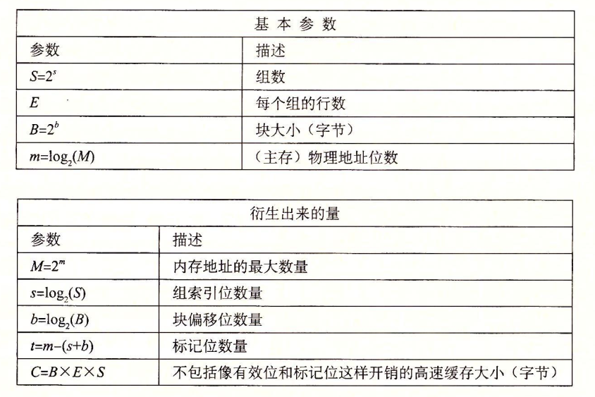

##  直接映射高速缓存
根据每个组的高速缓存行数E，高速缓存有以下几类：

* 直接映射高速缓存：每个组只有一行，即 E=1。
* 组相联高速缓存：每个组有多行，1<E<C/B。
* 全相联高速缓存：只有一个组，E=C/B。

假设一个系统中只有 CPU、L1 高速缓存和主存。当 CPU 执行一条从内存读字 w 的指令，如果 L1 有 w 的副本，就得到 L1 高速缓存命中；如果 L1 没有，就是缓存不命中。当缓存不命中，L1 会向主存请求包含 w 的块(L1 中的块就是它的高速缓存行)的一个副本。当块从内存到达 L1，L1 将这个块存在它的一个高速缓存行里，然后从中抽取出字 w，并返回给 CPU。

高速缓存确定一个请求是否命中，然后抽取出被请求的字的过程分为三步：

1. **组选择**
2. **行匹配**
3. **字抽取**

6.4.2 直接映射高速缓存
1、直接映射高速缓存中的组选择

**1、直接映射高速缓存中的组选择**

​    

从 w 的 m 位地址中抽取出 s 个组索引位，并据此选择相应的高速缓存组。

**2、直接映射高速缓存中的行匹配**

 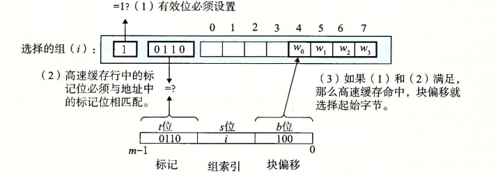

因为直接映射高速缓存每个组只有一行，只要这一行设置了有效位且标记位相匹配，就说明想要的字的副本确实存储在这一行中。

**3、直接映射高速缓存中的字抽取**

从 w 的地址中抽取出 b 个块偏移位，块偏移位提供了所需的字的第一个字节的偏移。

**4、直接映射高速缓存不命中时的行替换**

缓存不命中时需要从下一层取出被请求的块，然后将其存储在组索引位指示的组中的高速缓存行中。

因为直接映射高速缓存每个组只有一行，所以替换策略很简单：用新取出的行替换当前行。

**5、运行中的直接映射高速缓存**

标记位和索引位连接起来标识了整个内存中的所有块，而高速缓存中的高速缓存组（块）是少于内存中的块数的。因此位于不同标记位，相同组索引位的块会映射到高速缓存中的同一个高速缓存组。

在一个高速缓存组中存储了哪个块，可以由标记位唯一地标识。

理解：对于主存中的整个地址空间，根据标记位不同将其分为了若干个部分，每个部分可以单独且完整地映射到高速缓存中，且刚好占满整个直接映射高速缓存。

**6、直接映射高速缓存中的冲突不命中**

冲突不命中在直接映射高速缓存中很常见。因为每个组只有一行，不同标记位的块会映射到同一行，发生冲突不命中。

**为什么用中间的位来做索引？**

 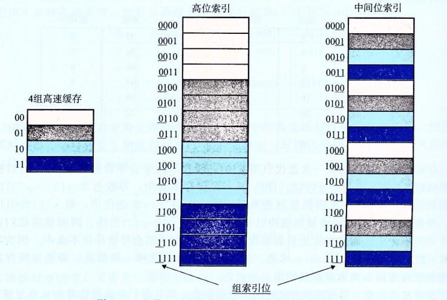

如果用高位做索引，那么一些连续的内存块就会被映射到相同的高速缓存块。顺序访问数组元素时，任意时刻，高速缓存都只能保存一个块大小的数据内容。相比较而言，以中间位作为索引，相邻的块总是映射到不同的高速缓存行。

## 组相联高速缓存

**1、组相联高速缓存中的组选择**

与直接映射高速缓存一样，组索引位标识组。

**2、组相联高速缓存中的行匹配**

组相联高速缓存中的行匹配更复杂，因为要**检查多个行的标记位和有效位**，以确定其中是否有所请求的字。

注意：组中的任意一行都可能包含映射到这个组的内存块，因此**必须搜索组中的每一行**，寻找一个有效且标记位相匹配的行。

**3、组相联高速缓存中的字抽取**

与直接映射高速缓存一样，块偏移位标识所请求的字的第一个字节。

**4、组相联高速缓存中不命中时的行替换**

**几种替换策略**

1. **随机替换策略：**随机选择要替换的行
2. **最不常使用策略：**替换在过去某个时间窗口内引用次数最少的一行。
3. **最近最少使用策略：**替换最后一次访问时间最久远的那一行。

因为存储器层次结构中越靠下，不命中开销越大，好的替换策略越重要。

## 全相联高速缓存
全相联高速缓存由**一个包含所有高速缓存行 (E=C/B) 的组组成**。

因为高速缓存电路必须并行地搜索不同组已找到相匹配的标记，所以全相联高速缓存只适合做小的高速缓存。

DRAM 主存采用了全相联高速缓存，但是因为它采用了虚拟内存系统，所以在进行类似行匹配的页查找时不需要对一个个页进行遍历。

**1、全相联高速缓存中的组选择**

全相联高速缓存中只有一个组，所以地址中没有组索引位，只有标记位和块偏移位。

**2、全相联高速缓存中的行匹配和字抽取**

与组相联高速缓存一样。与组相联高速缓存的区别在于规模大小

##  有关写的问题
写相比读要复杂一些。

写命中（写一个已经缓存了的字 w）的情况下，高速缓存更新了本层的 w 的副本后，如何处理低一层的副本有两种方法：

1. **直写**：立即将 w 的高速缓存块写回到低一层中。

2. 1. 优点：简单
   2. 缺点：每次写都会占据总线流量

3. **写回**：尽可能地推迟更新，只有当替换算法要驱逐这个更新过的块时，才把它写到低一层中。

4. 1. **优点：利用了局部性，可以显著地减少总线流量。**
   2. 缺点：增加了复杂性。必须为每个高速缓存行维护一个额外的修改位，表明此行是否被修改过。

**写不命中**情况下的两种方法：

1. **写分配**：加载相应的低一层的块到本层中，然后更新这个高速缓存块。

2. 1. 优点：利用写的空间局部性
   2. 缺点：每次不命中都会导致一个块从低一层传送到高速缓存

3. **非写分配**：避开高速缓存，直接把这个字写到低一层中

直写一般与非写分配搭配，两者都更适用于存储器层次结构中的较高层。

**写回一般与写分配搭配，两者都更适用于存储器层次结构中的较低层，因为较低层的传送时间太长。**

因为硬件上复杂电路的实现越来越容易，所以现在使用写回和写分配越来越多。

##  一个真实的高速缓存层次结构的解剖

三种高速缓存：

* i-cache：只保存指令的高速缓存。i-cache 通常是只读的，因此比较简单。

* d-cache：只保存程序数据的高速缓存。
* 统一的高速缓存：既保存指令又保存程序数据。
  

现代处理器一般包括独立的 i-cache 和 d-cache，其中两个原因如下：

* 使用两个独立的高速缓存，CPU 可以同时读一个指令字和一个数据字。
* 可以确保数据访问不会与指令访问形成冲突不命中（不过可能会使容量不命中增加）。

Core i7 的高速缓存层次结构及其特性：

 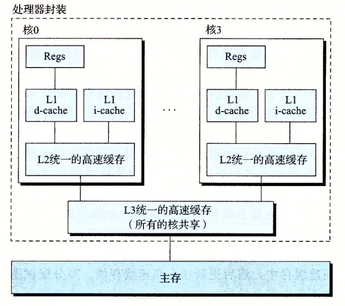

Core i7 高速缓存层次结构的特性：


可以看到 Core i7 中的**高速缓存采用的都是组相联高速缓存**。

## 高速缓存参数的性能影响

**高速缓存的性能指标**

1. **命中率：**命中的内存引用比率。
2. **命中时间**：从高速缓存传送一个字到 CPU 的时间，包括组选择、行确认和字抽取的实践。
3. **不命中处罚：**不命中产生的额外时间消耗。

**几个影响因素**

1. 高速缓存大小：较大的高速缓存可以提高命中率，但是会运行得更慢，即增加命中时间。
2. 块大小：较大的块更能利用空间局部性以提高命中率。但是对于给定的总容量，块越大高速缓存行就越少，不利用利用时间局部性。较大的块因为传送时间更长，所以也会增加不命中处罚。现代处理系统的高速缓存块一般为 64 字节。
3. 相联度。
4. 写策略。