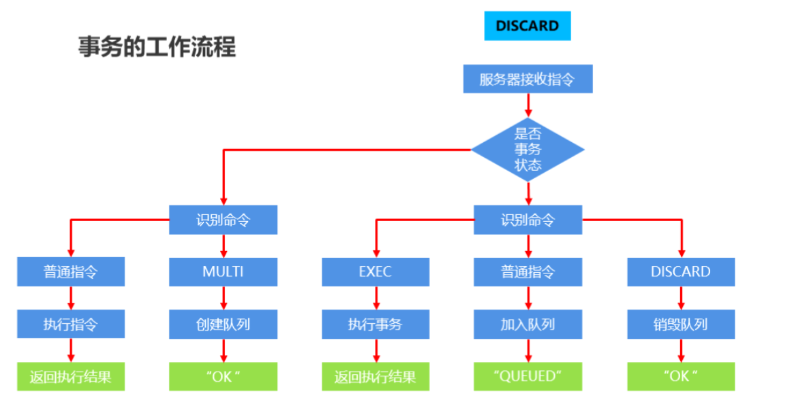
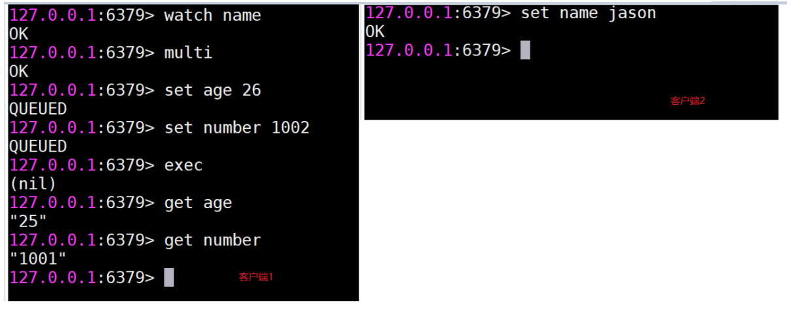

# Redis事务

## 事务简介

为什么需要事务操作？  ——>  Redis执行指令过程中，多条连续执行的指令被干扰，打断，插队。

例如，客户端1在执行set name  get name操作之间，客户端2执行了set name操作，就会导致客户端无法获取预期的结果。


由于上述问题，引入了redis事务的概念，redis事务就是一个命令执行的队列，将一系列预定义命令包装成一个整体（一个队列）。当执行时，一次性按照添加顺序依次执行，中间不会被打断或者干扰。

## 事务基本操作

* 开启事务     multi

* 执行事务     exec

* 取消事务     discard

注意：加入事务的命令暂时进入到任务队列中，并没有立即执行，只有执行exec命令才开始执行。

## 事务的注意事项

1.定义事务的过程中，命令格式输入错误怎么办？

- 语法错误
     - 指命令书写格式有误。
- 处理结果
     - 如果定义的事务中所包含的命令`存在语法错误，整体事务中所有命令均不会执行`。包括那些语法正确的命令。

```
127.0.0.1:6379> multi
OK
127.0.0.1:6379> set name jason
QUEUED
127.0.0.1:6379> set age11111
(error) ERR wrong number of arguments for 'set' command
127.0.0.1:6379> exec
(error) EXECABORT Transaction discarded because of previous errors.
127.0.0.1:6379> get name
"Bob"
127.0.0.1:6379>
```

2.定义事务的过程中，命令执行出现错误怎么办？

- 运行错误
     - 指命令格式正确，但是无法正确的执行。例如对list进行incr操作
- 处理结果
     - 能够正确运行的命令会执行，运行错误的命令不会被执行。

```
127.0.0.1:6379> multi
OK
127.0.0.1:6379> set name jason
QUEUED
127.0.0.1:6379> set age 25
QUEUED
127.0.0.1:6379> incr name
QUEUED
127.0.0.1:6379> exec
1) OK
2) OK
3) (error) ERR value is not an integer or out of range
127.0.0.1:6379>
```

注意：已经执行完毕的命令对应的数据不会自动回滚，需要程序员自己在代码中实现回滚。

## 事务的工作流程



## 事务中锁的应用

### 基于特定条件的事务执行——锁


应用场景1：京东618促销活动，需要对于售罄的货物追加补货， 但是多个业务员都有补货权限。补货的操作可能是一系列的操作，牵扯到多个连续操作，如何保障不会重复操作？

业务分析：

1. 多个客户端有可能同时操作同一组数据，并且该数据一旦被操作修改后，将不适用于继续操作
2. 在操作之前锁定要操作的数据，一旦发生变化，终止当前操作


解决方案：基于特定条件的事务执行——锁。
```
对 key 添加监视锁，在执行exec前如果key发生了变化，终止事务执行
watch key1 [key2……]

取消对所有 key 的监视
unwatch
```

watch操作要先于multi操作：



### 基于特定条件的事务执行——分布式锁

应用场景2：京东618促销活动，对于售罄的货物追加补货，且补货完成。顾客购买欲强烈，3秒内将所有商品购买完毕。本次补货已经将库存全部清空，如何避免最后一件商品不被多人同时购买？

业务分析:

1. 使用watch监控一个key有没有改变已经不能解决问题，此处要监控的是具体数据。
2. 虽然redis是单线程的，但是多个客户端对同一数据同时进行操作时，如何避免不被同时修改？

解决方案：基于特定条件的事务执行——分布式锁
```
使用 setnx 设置一个公共锁

利用setnx命令的返回值特征，有值则返回设置失败，无值则返回设置成功
    对于返回设置成功的，拥有控制权，进行下一步的具体业务操作
    对于返回设置失败的，不具有控制权，排队或等待

操作完毕通过del操作释放锁
setnx lock-key value
```

操作举例：

客户端1在获取公共锁lock-num的时候，客户端2无法获取对应锁。


### 基于特定条件的事务执行——分布式锁改良

应用场景3：如果依赖分布式锁的机制，某个用户操作时对应客户端宕机，且此时已经获取到锁。如何解决？
业务分析：

1.由于锁操作由用户控制加锁解锁，必定会存在加锁后未解锁的风险
2.需要解锁操作不能仅依赖用户控制，系统级别要给出对应的保底处理方案

解决方案：基于特定条件的事务执行——分布式锁改良
```
使用 expire 为锁key添加时间限定，到时不释放，放弃锁
expire lock-key second
pexpire lock-key milliseconds

由于操作通常都是微秒或毫秒级，因此该锁定时间不宜设置过大。具体时间需要业务测试后确认。
例如：持有锁的操作最长执行时间127ms，最短执行时间7ms。
测试百万次最长执行时间对应命令的最大耗时，测试百万次网络延迟平均耗时
锁时间设定推荐：最大耗时*120%+平均网络延迟*110%
如果业务最大耗时<<网络平均延迟，通常为2个数量级，取其中单个耗时较长即可
```