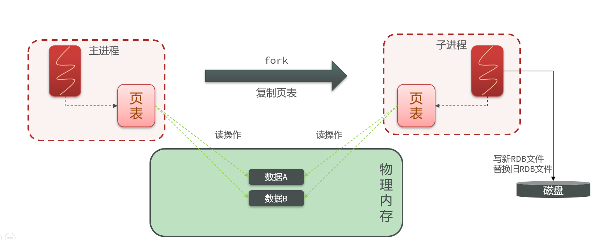

# Redis持久化

## 简介

- 概念：利用永久性存储介质将数据进行保存，在特定的时间将保存的数据进行恢复的工作机制称为持久化。

- 作用：防止数据的意外丢失，确保数据安全性。

- 持久化的实际应用举例：Microsoft Word 文档 异常断点的文档数据恢复；MySQL主备数据库设置，避免主机宕机的数据丢失。

## 机制

Redis提供两种持久化机制：

- RDB(Redis Database)：在指定的时间间隔能对你的数据进行快照存储。（数据快照）
- AOF(Append only file)：记录每次对服务器写的操作,当服务器重启的时候会重新执行这些命令来恢复原始的数据。（过程日志）

## RDB机制

### RDB启动方式——save指令

save指令由Redis主进程来执行RDB，会阻塞所有命令。

```
save  手动执行一次保存操作

save指令相关配置
dbfilename dump.rdb
说明：设置本地数据库文件名，默认值为 dump.rdb

dir
说明：设置存储.rdb文件的路径

rdbcompression yes
说明：设置存储至本地数据库时是否压缩数据，默认为 yes，采用 LZF 压缩

rdbchecksum yes
说明：设置是否进行RDB文件格式校验，该校验过程在写文件和读文件过程均进行
```

举例：redis-6379.conf文件内容

```
port 6379
daemonize yes
logfile 6379.log
dir /home/believe123/myproject/redis/redis-6.0.5/data
dbfilename dump-6379.rdb
rdbcompression yes
rdbchecksum yes
```


### RDB启动方式——bgsave指令

bgsave指令开启子进程执行RDB，避免主进程受到影响。

```
bgsave 手动启动后台保存操作，但不是立即执行

RDB启动方式 —— bgsave指令相关配置
dbfilename dump.rdb
dir
rdbcompression yes
rdbchecksum yes
stop-writes-on-bgsave-error yes
说明：后台存储过程中如果出现错误现象，是否停止保存操作
```

工作原理：


bgsave开始时会fork主进程得到子进程，子进程共享主进程的内存数据。完成fork后读取内存数据并写入 RDB 文件。fork采用的是copy-on-write技术：

•当主进程执行读操作时，访问共享内存；

•当主进程执行写操作时，则会拷贝一份数据，执行写操作。



### RDB启动方式——save配置

```
命令
save second changes

说明
满足限定时间范围内key的变化数量达到指定数量即进行持久化

参数
second：监控时间范围
changes：监控key的变化量

位置
在conf文件中进行配置
save second changes

举例：
save 300 10   （300秒中改变了10条数据就触发save）
save 60 10000

注意：
1.save配置要根据实际业务情况进行设置，频度过高或过低都会出现性能问题，结果可能是灾难性的
2.save配置中对于second与changes设置通常具有互补对应关系，尽量不要设置成包含性关系
3.save配置启动后执行的是bgsave操作

save配置相关配置
dbfilename dump.rdb
dir
rdbcompression yes
rdbchecksum yes
```

## AOF机制

针对RDB存储的弊端：

* 存储数据量较大，效率较低 （基于快照思想，每次读写都是全部数据，当数据量巨大时，效率非常低）
* 大数据量下的IO性能较低
* 基于fork创建子进程，内存产生额外消耗
* 宕机带来的数据丢失风险

解决思路：

* 不写全数据，仅记录部分数据
* 降低区分数据是否改变的难度，改记录数据为记录操作过程
* 对所有操作均进行记录，排除丢失数据的风险

### AOF的三种策略

AOF的三种策略如下：

1. always(每次)
2. everysec(每秒)
3. no(系统控制)

对应的优缺点：

| 策略     | 同步时机                              | 优点                  | 缺点                      |
| -------- | ------------------------------------- | --------------------- | ------------------------- |
| always   | 同步持久化                            | 可靠性高,几乎不丢数据 | 性能影响大                |
| everysec | 每秒记录                              | 性能适中              | 最多丢失1秒数据           |
| no       | 操作系统控制,将缓存回写的策略交给系统 | 性能最好              | 可靠性差,可能丢失大量数据 |

配置文件：
```
# 是否开启AOF，默认关闭（no）
appendonly yes

# 指定 AOF 文件名
appendfilename appendonly.aof

# Redis支持三种不同的刷写模式：
#appendfsync always (同步持久化，每次发生数据变更会被立即记录到磁盘，性能差但数据完整性比较好)
appendfsync everysec (异步操作，每秒记录，如果一秒钟内宕机，有数据丢失)
#appendfsync no （将缓存回写的策略交给系统，linux 默认是30秒将缓冲区的数据回写硬盘的）

#在日志重写时，不进行命令追加操作，而只是将其放在缓冲区里，避免与命令的追加造成DISK IO上的冲突。
#设置为yes表示rewrite期间对新写操作不fsync,暂时存在内存中,等rewrite完成后再写入，默认为no
no-appendfsync-on-rewrite no 

#当前AOF文件大小是上次日志重写得到AOF文件大小的二倍时，自动启动新的日志重写过程。
auto-aof-rewrite-percentage 100

#当前AOF文件启动新的日志重写过程的最小值，避免刚刚启动Reids时由于文件尺寸较小导致频繁的重写。
auto-aof-rewrite-min-size 64mb
```

### AOF重写

概念：

AOF重写是将Redis进程内的数据转化为写命令同步到新AOF文件的过程。 简单说就是将对同一个数据的若干个条命令执行结果转化成最终结果数据对应的指令进行记录。

作用：

* <font color='red'>**降低磁盘占用量，提高磁盘利用率**</font>
* 提高持久化效率，降低持久化写时间，提高IO性能
* 降低数据恢复用时，提高数据恢复效率

```
手动重写
bgrewriteaof

自动重写
auto-aof-rewrite-min-size size
auto-aof-rewrite-percentage percentage
```

# RDB和AOF区别

|                    | RDB                                          | AOF                    |
| ------------------ | -------------------------------------------- | ---------------------- |
| 持久化方式         | 定时对整个内存做快照                         | 记录每一次执行的命令   |
| 数据完整性、安全性 | 不完整、会丢失数据                           | 相对完整、依据策略决定 |
| 占用存储空间       | 小（数据级：压缩）                           | 大（指令级：重写）     |
| 存储速度           | 慢                                           | 快                     |
| 宕机恢复速度       | 快                                           | 慢                     |
| 系统资源消耗       | 高/重量级                                    | 低/轻量级              |
| 启动优先级         | 低                                           | 高                     |
| 使用场景           | 可以容忍数分钟的数据丢失，追求更快的启动速度 | 对数据安全性要求较高   |

## RDB与AOF的选择之惑

* 对数据非常敏感，建议使用默认的AOF持久化方案。
    * AOF持久化策略使用everysecond，每秒钟fsync一次。该策略redis仍可以保持很好的处理性能， 当出现问题时，最多丢失0-1秒内的数据。
    * 注意：由于AOF文件存储体积较大，且恢复速度较慢。

* 数据呈现阶段有效性，建议使用RDB持久化方案。
    * 数据可以良好的做到阶段内无丢失（该阶段是开发者或运维人员手工维护的），且恢复速度较快，阶段点数据恢复通常采用RDB方案
    * 注意：利用RDB实现紧凑的数据持久化会使Redis降的很低，慎重总结。
* 综合比对

    * RDB与AOF的选择实际上是在做一种权衡，每种都有利有弊。
    * 如不能承受数分钟以内的数据丢失，对`业务数据非常敏感`，选用AOF。
    * 如能承受数分钟以内的数据丢失， 且追求`大数据集的恢复速度`，选用RDB。
    * 灾难恢复选用RDB
    * 双保险策略，同时开启 RDB 和 AOF，重启后，Redis优先使用 AOF 来恢复数据，降低丢失数据的量。

