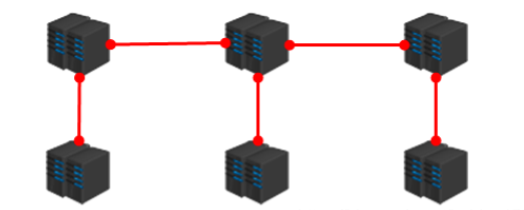
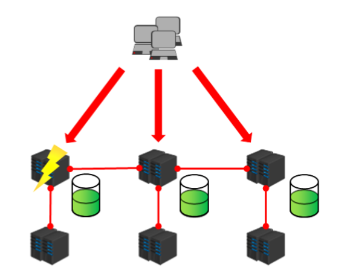
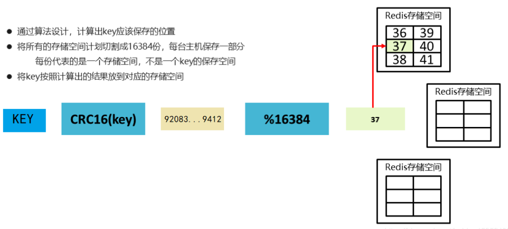
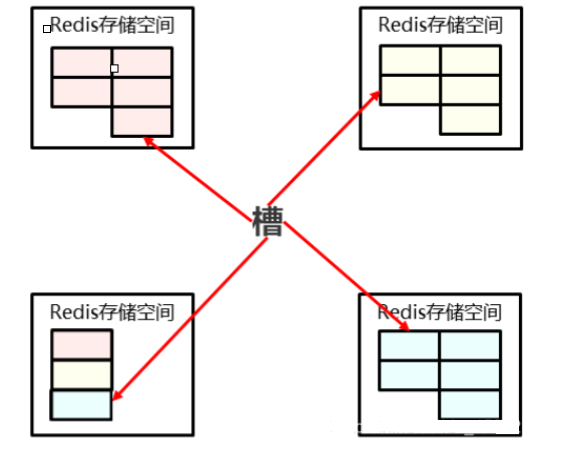
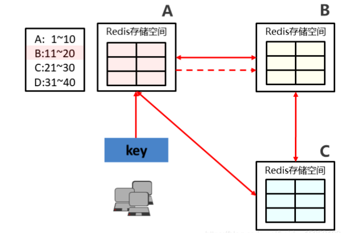
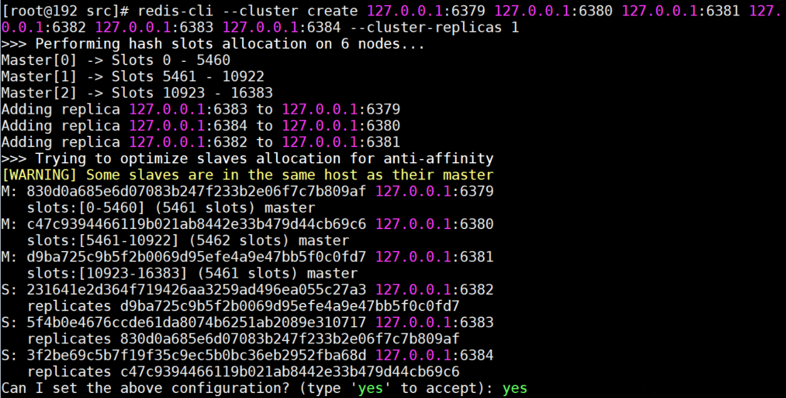

# Redis集群概念以及应用

## 简介

业务发展过程中遇到的峰值瓶颈: 

* redis服务器可以提供的服务OPS（Operation Per Second.每秒操作次数）已经可以达到10万/秒，但是仍然无法满足业务的高并发操作应该如何解决？
* 单机的内存不可能持续扩展，即使扩大到1T，仍然无法满足业务想内存存储需求怎么办？

针对上述问题，redis衍生出`集群`的概念，集群就是使用网络将若干台计算机联通起来，并提供统一的管理方式，使其对外呈现单机的服务效果。利用集群的方式进行管理，能够有效解决上述问题。集群示意图: 



集群作用: 

* 分散单台服务器的访问压力，实现负载均衡
* 分散单台服务器的存储压力，实现可扩展性
* 降低单台服务器宕机带来的业务灾难



## Redis集群结构设计

### 数据存储设计



当加入新的节点时，可以根据算法将其他值均匀地挪动到新的节点上。



### 集群内部通讯设计 

各个数据库相互通讯，保存各个库中槽的编号数据。如果客户端向A发起请求，根据key计算得到其保存的位置，例如15。然后根据A中记录的槽的编号数据，找到对应存储内容在B中。

即数据命中仅存在以下两种情况: 

1. 一次命中，直接返回

2. 一次未命中，告知具体位置



### Cluster集群结构搭建

原生安装（单条命令）

* 配置服务器（3主3从）
* 建立通信（Meet）
* 分槽（Slot）
* 搭建主从（master-slave）

```bash
1.首先安装ruby
[root@192 src]#yum install ruby
[root@192 src]# ruby -v
ruby 2.0.0p648 (2015-12-16) [x86_64-linux]
[root@192 src]# gem -v
2.0.14.1

2.打开六个窗口分别启动服务器
cd /home/believe123/myproject/redis/cluster/

redis-server ./redis-6379.conf
redis-server ./redis-6380.conf
redis-server ./redis-6381.conf
redis-server ./redis-6382.conf
redis-server ./redis-6383.conf
redis-server ./redis-6384.conf

3.创建集群
redis-cli --cluster create 127.0.0.1:6379 127.0.0.1:6380 127.0.0.1:6381 127.0.0.1:6382 127.0.0.1:6383 127.0.0.1:6384 --cluster-replicas 1
```

创建集群后返回信息如下，最后还需确认直接输入yes即可。



如果直接连接到6379客户端，执行set name操作，提示重定向到6380，要用redis-cli -c才可以，-c表示集群。

```bash
[root@192 ~]# redis-cli
127.0.0.1:6379> set name jason
(error) MOVED 5798 127.0.0.1:6380
127.0.0.1:6379>
[root@192 ~]# redis-cli  -c
127.0.0.1:6379> set name jason
-> Redirected to slot [5798] located at 127.0.0.1:6380
OK
127.0.0.1:6380> get name
"jason"
127.0.0.1:6380>


127.0.0.1:6381> get name
-> Redirected to slot [5798] located at 127.0.0.1:6380
"jason"
127.0.0.1:6380>
```