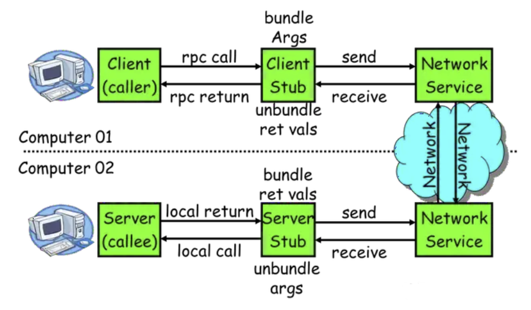

# grpc概念

记录grpc学习的内容。

# 参考资料

[RPC原理及实现](https://www.jianshu.com/p/c113a9592044)

[RPC（三）《Implementing Remote Procedure Calls》译文](https://www.jianshu.com/p/91be39f72c74)

# 背景

从单机走向分布式，产生了很多分布式的通信方法

- 最古老也是最有效，并且永不过时的，TCP/UDP的二进制传输。事实上所有的通信方式归根结底都是TCP/UDP。（属于计算机网络的传输层，传输协议在计算机之间提供通信会话。传输协议的选择根据数据传输方式而定。传输控制协议TCP和用户数据报协议UDP）
- Web Service 
  - 基于 http + xml 的标准化 Web API  （待研究WebService，感觉不是xml，返回的有时候是html的网页）
- RestFul    (Representational State Transfer)
  - 回归简单化本源的Web API   http +json  ,提供一个网址返回 json 串 
- RPC  (Remote Procedure Call)
  - 远程过程调用

# rpc概念

## 基本概念

RPC(Remote Procedure Call)即远程过程调用，允许一台计算机调用另一台计算机上的程序得到结果，而代码中不需要做额外的编程，就像在本地调用一样。

## RPC的角色

在RPC框架中主要有三个角色：Provider、Consumer和Registry。

节点角色说明：

* Server: 暴露服务的服务提供方。

* Client: 调用远程服务的服务消费方。

* Registry: 服务注册与发现的注册中心。

## RPC调用流程

RPC基本流程图：



一次完整的RPC调用流程（同步调用，异步另说）如下：

1）服务消费方（client）调用以本地调用方式调用服务；

2）client stub接收到调用后负责将方法、参数等组装成能够进行网络传输的消息体；

3）client stub找到服务地址，并将消息发送到服务端；

4）server stub收到消息后进行解码；

5）server stub根据解码结果调用本地的服务；

6）本地服务执行并将结果返回给server stub；

7）server stub将返回结果打包成消息并发送至消费方；

8）client stub接收到消息，并进行解码；

9）服务消费方得到最终结果。

RPC框架的目标就是要2~8这些步骤都封装起来，让用户对这些细节透明。

# RPC框架演进过程

从基础的架构一步步进行完善：

- rpc01 客户端等待服务器端连接，客户端将数据通过二进制传给服务器端。服务器端收到数据后，在数据库进行查询，得到一个对象。然后将对象中的每个属性通过二进制传递给客户端。客户端读取每一个属性后，new为一个新的对象。(最原始的方法，很不灵活)

- rpc02 从客户端分离出一个stub类，作为代理，从而屏蔽一些网络细节。(缺点:在这个stub类里只能代理一个方法，并返回这一个类)

- rpc03 stub类通过动态代理返回了一个动态对象。这个对象所属的类实现了IUserService接口。在这个接口实在的方法屏蔽了一些网络的细节。(当换用不同的方法后，传输数据会有问题)

- rpc04 当换用不同的方法后，stub类拿到对应的方法名和参数类型(防止重载的情况)和参数，写给服务器端，服务器端通过反射的方式找到方法，然后调用相应的方法，返回给stub。(不足:只能支持同一个接口的很多方法，不能支持很多个接口的很多方法。stub返回值仍然是对象的每个属性)

- rpc05 在服务器的直接用writeobject方法把对象写出去(这个版本可以让IUserService随意的暴露和变换接口，客户端只能拿到一个接口)

- rpc06 stub中为class类型的对象。得到类的名字，方法的名字，方法的类型和具体参数传给服务器端。服务器端从服务注册表找到具体的类。实现类可以通过spring进行注入。然后通过具体实现类的对象，调用相应的方法。(能够生成更多类型的代理)


# 涉及的选型

  

  

## rpc序列化框架

1.java.io.Serializable(java自带的)

2.Hessian

3.google protobuf

4.facebook Thrift

5.kyro

6.fst

7.json序列化框架

​    1.Jackson

​	2.google Gson

   3.Ali FastJson
8.xmlrpc

## RPC的网络协议选择

* TCP/IP

* HTTP

* web Service ——基于http + xml 的标准化Web API

* RestFul    —— 回归简单化本源的Web API   http +json  ,提供一个网址返回json串

* mail

  

  
  
  
  
  由我们的RPC包提供的绑定操作是将一个接口的导入器绑定到接口的导出器。绑定之后，导入器发出的调用将会调用被（远程）导出器实现的过程。
  
  当一个导入器希望绑定到一个导出器时，user code会调用它的uset-stub，随后user-stub会调用RPCRuntime中的一个过程，即导入接口，为其提供所需的接口类型和实例。
  
  RPCRuntime通过向Grapevine请求网络地址（即接口实例的连接地址）来确定的导出器（如果有的话）的网络地址。
  
  即tars中，基于名字服务的概念，其实一个名字关联到一个地址，由内部路由实现。 同时，tars的服务提供者一般会有启动多个线程，来提高客户端调用。
  
  
  
  下一步：包层级传输协议
  
  
  
  

```
这样写，在vscode里点击函数会提示对应信息

/**
     * @brief  取出当前时间的微秒.
     * @brief  Take out microseconds of current time.
     *
     * @return int64_t 取出当前时间的微秒
     * @return int64_t Take out microseconds of current time.
     */
    static int64_t now2us();
```


# 手写RPC框架

```
std::tuple
template <class... Types> class tuple;
Tuple
A tuple is an object capable to hold a collection of elements. Each element can be of a different type.

```

