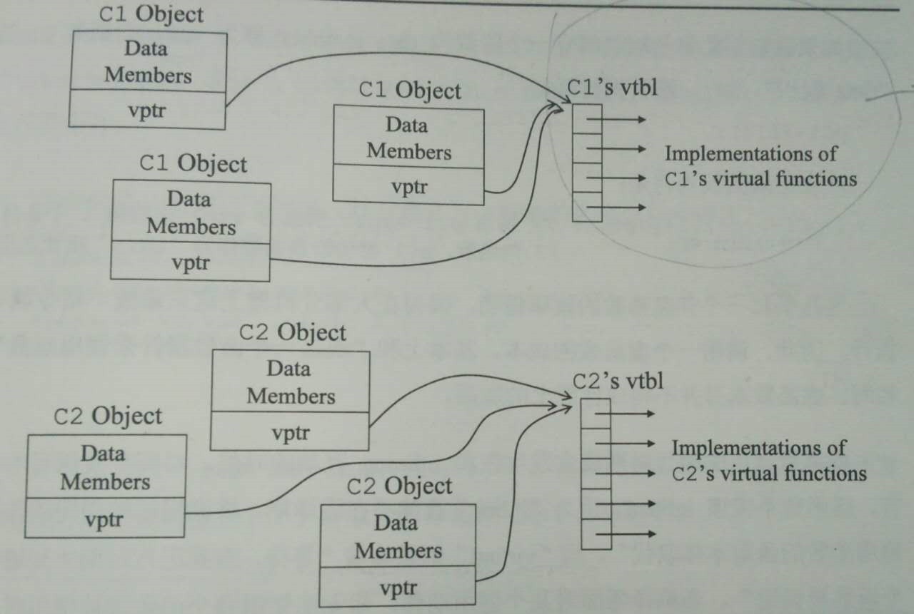
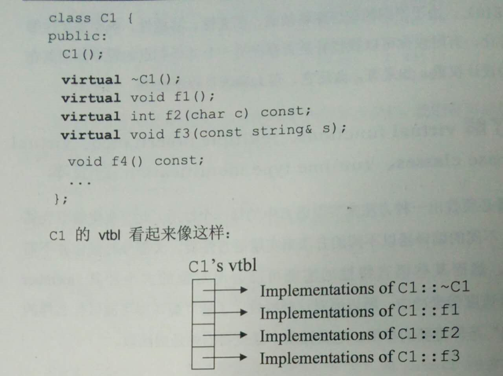
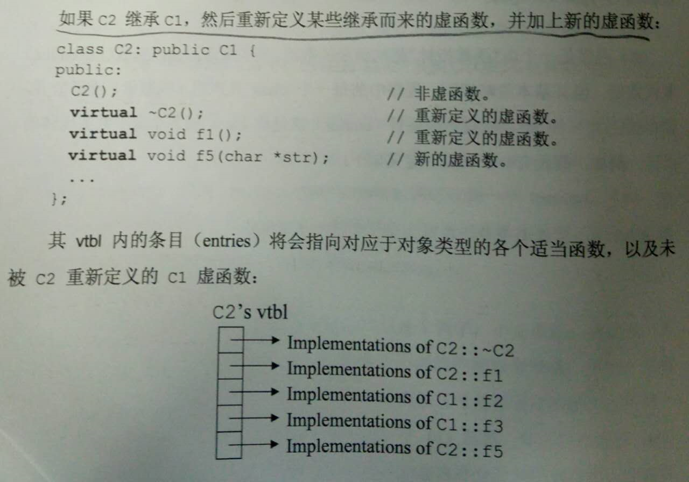
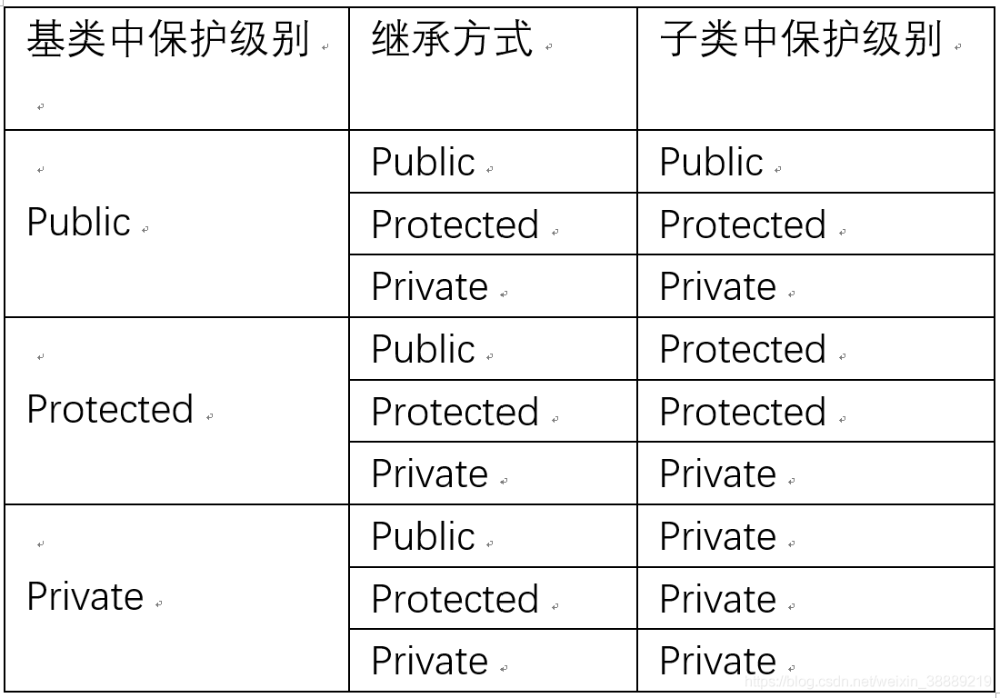

# C++知识

## 参考资料

## 目录

TortoiseGit小乌龟 + git 实现版本管理

* [1. 基类析构函数为什么要定义为虚函数？](#-基类析构函数为什么要定义为虚函数？)
* [2. 深拷贝和浅拷贝](#-深拷贝和浅拷贝)
* [3. new与malloc有什么区别？](#-new与malloc有什么区别？)
* [4. C++重载、重定义、重写的区别](#-C++重载、重定义、重写的区别)
* [5. 构造函数和析构函数能否重载？](#-构造函数和析构函数能否重载？)
* [6. c++如何避免内存泄漏](#-c++如何避免内存泄漏)
* [7. const](#-const)
* [8. C++中指针和引用的区别](#-C++中指针和引用的区别)
* [9. 拷贝构造函数的参数类型必须是引用](#-拷贝构造函数的参数类型必须是引用)
* [10. 为什么内联函数，构造函数，静态成员函数不能为virtual函数？](#-为什么内联函数，构造函数，静态成员函数不能为virtual函数？)
* [11. 迭代器失效的场景](#-迭代器失效的场景)
* [12. C++虚函数表和虚函数指针机制](#-C++虚函数表和虚函数指针机制)
* [13. C++中类成员的访问权限](#-C++中类成员的访问权限)
* [14. C++class和struct有什么区别](#-C++class和struct有什么区别)
* [15. C/C++源文件生成可执行文件过程](#-C/C++源文件生成可执行文件过程)
* [16. C++，什么是右值引用，跟左值有什么区别？](#-C++，什么是右值引用，跟左值有什么区别？)
* [17. include头文件的顺序以及双引号””和尖括号的区别？](#-include头文件的顺序以及双引号””和尖括号的区别？)
* [18. 什么时候会发生段错误](#-什么时候会发生段错误)
* [19. C++STL的内存优化](#-C++STL的内存优化)
* [20. C++互斥锁、自旋锁、读写锁、悲观锁、乐观锁的应用场景](#-C++互斥锁、自旋锁、读写锁、悲观锁、乐观锁的应用场景)


## C++问题记录

## 基类析构函数为什么要定义为虚函数？

- 当基类指针指向派生类时，若基类析构函数不声明为虚函数，则析构时，只会调用基类而不会调用派生类的析构函数，从而导致内存泄漏。

## 构造函数不可能为虚函数

- 如果构造函数是虚函数，则需要通过vptr执行那个vtable(存储在对象的内存空间的)，可是对象还没有实例化，
也就是内存空间还没有，无法找到vtable，所以构造函数不能是虚函数。

备注: 当类中声明虚函数时，编译器会在类中生成一个虚函数表，虚函数表是一个存储成员函数指针的数据结构。
虚函数表是由编译器自动生成与维护的，virtual成员函数会被编译器放入虚函数表中，当存在虚函数时，
每个对象都有一个指向虚函数的指针（vptr指针）。在实现多态的过程中，父类和派生类都有vptr指针。

## 深拷贝和浅拷贝

- 深拷贝(Memberwise copy semantics)是指源对象与拷贝对象互相独立，其中任何一个对象的改动都不会对另外一个对象造成影响。

- 浅拷贝(bitwise copy semantics)是指源对象与拷贝对象共用一份实体，仅仅是引用的变量不同（名称不同）。对其中任何一个对象的改动都会影响另外一个对象。

- 浅拷贝在类里面有指针成员的情况下只会复制指针的地址，会导致两个成员指针指向同一块内存，这样在要是分别delete释放时就会出现问题，因此需要用深拷贝。

如果在类中没有显式地声明一个拷贝构造函数，那么，编译器将会自动生成一个默认的拷贝构造函数，该构造函数完成对象之间的浅拷贝。
举例如下: 
如果CA(const CA& C) 中没有使用str=new char[a]进行深拷贝，return 0的时候，调用B的析构函数释放char *str的内容，再次调用A的析构函数就会
报错。
```c++
#include <iostream>
using namespace std;
class CA
{
　public:
　　CA(int b,char* cstr)
　　{
　　　a=b;
　　　str=new char[b];
　　　strcpy(str,cstr);
　　}
　　CA(const CA& C)
　　{
　　　a=C.a;
　　　str=new char[a]; //深拷贝 str = C.str则为浅拷贝
　　　if(str!=NULL)
　　　　strcpy(str,C.str);
　　}
　　void Show()
　　{
　　　cout<<str<<endl;
　　}
　　~CA()
　　{
　　　delete str;
　　}
　private:
　　int a;
　　char *str;
};

int main()
{
　CA A(10,"Hello!");
　CA B=A;
　B.Show();
　return 0;
} 

```

## new与malloc有什么区别？

- 申请的内存所在位置: new操作符从自由存储区（free store）上为对象动态分配内存空间，而malloc函数从堆上动态分配内存。
- 返回类型安全性: new操作符内存分配成功时，返回的是对象类型的指针，类型严格与对象匹配，无须进行类型转换，故new是符合类型安全性的操作符。
而malloc内存分配成功则是返回void * ，需要通过强制类型转换将void*指针转换成我们需要的类型。
- 内存分配失败时的返回值: new内存分配失败时，会抛出bad_alloc异常，它不会返回NULL；malloc分配内存失败时返回NULL。
```
int *a  = (int *)malloc ( sizeof (int ));
if(NULL == a)
{
    ...
}
else 
{
    ...
}

try
{
    int *a = new int();
}
catch (bad_alloc)
{
    ...
}
```
- 是否需要指定内存大小: 使用new操作符申请内存分配时无须指定内存块的大小，编译器会根据类型信息自行计算，而malloc则需要显式地指出所需内存的尺寸。
- 是否调用构造函数/析构函数: new/delete会调用对象的构造函数/析构函数以完成对象的构造/析构。而malloc则不会。
- 对数组的处理: C++提供了new[]与delete[]来专门处理数组类型,malloc，它并知道你在这块内存上要放的数组还是啥别的东西，
反正它就给你一块原始的内存，在给你个内存的地址就完事。所以如果要动态分配一个数组的内存，还需要我们手动自定数组的大小。
```
A * ptr = new A[10];//分配10个A对象
delete [] ptr;

int * ptr = (int *) malloc( sizeof(int)* 10 );//分配一个10个int元素的数组
```
- new与malloc是否可以相互调用: operator new /operator delete的实现可以基于malloc，而malloc的实现不可以去调用new。
- 是否可以被重载: opeartor new /operator delete可以被重载。malloc/free并不允许重载。
- 能够直观地重新分配内存: 使用malloc分配的内存后，如果在使用过程中发现内存不足，可以使用realloc函数进行内存重新分配实现内存的扩充。
realloc先判断当前的指针所指内存是否有足够的连续空间，如果有，原地扩大可分配的内存地址，并且返回原来的地址指针；如果空间不够，
先按照新指定的大小分配空间，将原有数据从头到尾拷贝到新分配的内存区域，而后释放原来的内存区域。new没有这样直观的配套设施来扩充内存。
- 客户处理内存分配不足: 在operator new抛出异常以反映一个未获得满足的需求之前，它会先调用一个用户指定的错误处理函数，这就是new-handler。
对于malloc，客户并不能够去编程决定内存不足以分配时要干什么事，只能看着malloc返回NULL。

总结: 

特征 | new/delete | malloc/free
---|---|---
分配内存的位置|自由存储区|堆
内存分配成功的返回值|完整类型指针|void*
内存分配失败的返回值|默认抛出异常|返回NULL
分配内存的大小|由编译器根据类型计算得出|必须显式指定字节数
已分配内存的扩充|无法直观地处理|使用realloc简单完成
分配内存时内存不足|客户能够指定处理函数或重新制定分配器|无法通过用户代码进行处理
处理数组|有处理数组的new版本new[]|需要用户计算数组的大小后进行内存分配
是否相互调用|可以,看具体的operator new/delete实现|不可调用new
函数重载|允许|不允许
构造函数与析构函数|调用|不调用

## C++重载、重定义、重写的区别

- 重载
```
1. 在同一个作用域下，函数名相同，函数的参数不同（参数不同指参数的类型或参数的个数不相同，const和非const）
2. 不能根据返回值判断两个函数是否构成重载。
3. 当函数构成重载后，调用该函数时，编译器会根据函数的参数选择合适的函数进行调用。
4. 构成重载的例子: 
int Add( int a , int b )
double Add( double a , double b )
```

- 重定义（隐藏）
```
1. 在不同的作用域下（这里不同的作用域指一个在子类，一个在父类 ），函数名相同的两个函数构成重定义。
2. 当两个函数构成重定义时，父类的同名函数会被隐藏，当用子类的对象调用同名的函数时，如果不指定类作用符，就只会调用子类的同名函数。
3. 如果想要调用父类的同名函数，就必须指定父类的域作用符。
注意: 当父类和子类的成员变量名相同时，也会构成隐藏。

```

```c++
class A
{
public :
       void fun1( char c )
      {
           cout << "A::fun1()" << endl;
      }
       int _a;
};
class B : public A
{
public :
       void fun1( int a , int b )
      {
           cout << "B::fun1()" << endl;
      }
       int _b;
};
int main()
{
      B b;
      b.fun1( 'a' );
      system( "pause" );//b.A::fun1();
      return 0;
}
```

- 重写（覆盖）

```
1.在不同的作用域下（一个在父类，一个在子类），函数的函数名、参数、返回值完全相同，父类必须含有virtual关键字（协变除外）。
2.什么是协变？
（1）函数的函数名相同，参数也相同，但是函数的返回值可以不同（但必须只能是一个返回父类的指针（或引用）一个返回子类的指针（或引用），父类必须含有virtual关键字。
（2）构成协变的一种方式，返回指针；
```

## 构造函数和析构函数能否重载？

- 函数重载就是同一函数名的不同实现，并且能在编译时能与一具体形式匹配，这样参数列表必须不一样。由于重载函数与普通函数的差别是没有返回值，而返回值不能确定函数重载，所以构造函数可以重载；析构函数的特点是参数列表为空，并且无返回值，从而不能重载。

## c++如何避免内存泄漏
```
1. 使用RAII(ResourceAcquisition Is Initialization,资源获取即初始化)技法，以构造函数获取资源(内存),析构函数释放。
2. 相比于使用原生指针，更建议使用智能指针，尤其是C++11标准化后的智能指针，例如share_ptr。
3. 注意new/delete和new[]/delete[]的使用方法。
4. 类的copy constructor函数，可能造成内存泄漏，当原始对象中有动态分配的成员变量时，默认copy constructor函数会采用浅拷贝，
从而导致析构时，同一个资源被释放两次
```
## const

#### 作用

1. 修饰变量，说明该变量不可以被改变；
2. 修饰指针，分为指向常量的指针和指针常量；
3. 常量引用，经常用于形参类型，即避免了拷贝，又避免了函数对值的修改；
4. 修饰成员函数，说明该成员函数内不能修改成员变量。因为const函数中的*this是常量，同样只能访问const函数；

#### 使用

const 使用

```cpp
// 类
class A
{
private:
    const int a;                // 常对象成员，只能在初始化列表赋值

public:
    // 构造函数
    A() : a(0) { };
    A(int x) : a(x) { };        // 初始化列表

    // const可用于对重载函数的区分
    int getValue();             // 普通成员函数
    int getValue() const;       // 常成员函数，不得修改类中的任何数据成员的值
};

void function()
{
    // 对象
    A b;                        // 普通对象，可以调用全部成员函数、更新常成员变量
    const A a;                  // 常对象，只能调用常成员函数
    const A *p = &a;            // 常指针
    const A &q = a;             // 常引用

    // 指针
    char greeting[] = "Hello";
    char* p1 = greeting;                // 指针变量，指向字符数组变量
    const char* p2 = greeting;          // 指针变量，指向字符数组常量
    char* const p3 = greeting;          // 常指针，指向字符数组变量
    const char* const p4 = greeting;    // 常指针，指向字符数组常量
}

// 函数
void function1(const int Var);           // 传递过来的参数在函数内不可变
void function2(const char* Var);         // 参数指针所指内容为常量
void function3(char* const Var);         // 参数指针为常指针
void function4(const int& Var);          // 引用参数在函数内为常量

// 函数返回值
const int function5();      // 返回一个常数
const int* function6();     // 返回一个指向常量的指针变量，使用: const int *p = function6();
int* const function7();     // 返回一个指向变量的常指针，使用: int* const p = function7();
```

## C++中指针和引用的区别

1. 本质: 指针是一个变量，存储内容是一个地址，指向内存的一个存储单元。而引用是原变量的一个别名，实质上和原变量是一个东西，是某块内存的别名。
2. 指针的值可以为空，且非const指针可以被重新赋值以指向另一个不同的对象。而引用的值不能为空，并且引用在定义的时候必须初始化，一旦初始化，就和原变量“绑定”，不能更改这个绑定关系。
3. 对指针执行sizeof()操作得到的是指针本身的大小（32位系统为4,64位系统为8）。而对引用执行sizeof()操作得到的是所绑定的对象的所占内存大小。
4. 指针的自增(++)运算表示对地址的自增，自增大小要看所指向单元的类型。而引用的自增(++)运算表示对值的自增。
5. 在作为函数参数进行传递时的区别: 指针所以函数传输作为传递时，函数内部的指针形参是指针实参的一个副本，改变指针形参并不能改变指针实参的值，通过解引用*运算符来更改指针所指向的内存单元里的数据。而引用在作为函数参数进行传递时，实质上传递的是实参本身，即传递进来的不是实参的一个拷贝，因此对形参的修改其实是对实参的修改，所以在用引用进行参数传递时，不仅节约时间，而且可以节约空间。

## 拷贝构造函数的参数类型必须是引用

- 如果拷贝构造函数中的参数不是一个引用，即形如CClass(const CClass c_class)，那么就相当于采用了传值的方式(pass-by-value)，而传值的方式会调用该类的拷贝构造函数，从而造成`无穷递归地调用拷贝构造函数`。因此拷贝构造函数的参数必须是一个引用。
- 需要澄清的是，传指针其实也是传值，如果上面的拷贝构造函数写成CClass(const CClass* c_class)，也是不行的。事实上，只有传引用不是传值外，其他所有的传递方式都是传值。

在C++中，有下面三种对象需要拷贝的情况:

* 一个对象以值传递的方式传入函数体

* 一个对象以值传递的方式从函数返回

* 一个对象需要通过另外一个对象进行初始化

以上的情况就需要拷贝构造函数的调用。

当类中的数据成员需要动态分配存储空间时，不可以依赖default copy constructor。当default copy constructor被因编译器需要而合成时，将执行default bitwise copy语义。此时如果类中有动态分配的存储空间时，将会发生惨重的灾情。在需要时（包括这种对象要赋值、这种对象作为函数参数要传递、函数返回值为这种对象等情况），要考虑到自定义拷贝构造函数。

## 为什么内联函数，构造函数，静态成员函数不能为virtual函数？

1> 内联函数

内联函数是在编译时期展开,而虚函数的特性是运行时才动态联编,所以两者矛盾,不能定义内联函数为虚函数。

2> 构造函数

构造函数用来创建一个新的对象,而虚函数的运行是建立在对象的基础上,在构造函数执行时,对象尚未形成,所以不能将构造函数定义为虚函数

3> 静态成员函数

静态成员函数属于一个类而非某一对象,没有this指针,它无法进行对象的判别。

4> 友元函数

C++不支持友元函数的继承，对于没有继承性的函数没有虚函数

1. virtual意味着在执行时期进行绑定，所以在编译时刻需确定信息的不能为virtual。
2. virtual意味着派生类可以改写其动作。

https://github.com/klc407073648/interview#-%E9%9D%A2%E8%AF%95%E9%A2%98%E7%9B%AE%E7%BB%8F%E9%AA%8C
https://zhuanlan.zhihu.com/p/30996101

## 迭代器失效的场景

**迭代器**

迭代器（iterator）是一个可以对其执行类似指针的操作（如: 解除引用（operator*()）和递增（operator++()））的对象，我们可以将它理解成为一个指针。但它又不是我们所谓普通的指针，我们可以称之为广义指针，你可以通过sizeof（vector::iterator）来查看，所占内存并不是4个字节。
如下图所示: 

这里我们定义了一个vector迭代器，对其求sizeof（），发现是12个字节，并不是一个指针的大小。

那么我们常说的迭代器失效到底是什么呢？都有哪些场景会导致失效问题呢？我们一起来看以下具体场景及解决办法。

**序列式容器迭代器失效**

对于序列式容器，例如vector、deque；由于序列式容器是组合式容器，当当前元素的iterator被删除后，其后的所有元素的迭代器都会失效，这是因为vector，deque都是连续存储的一段空间，所以当对其进行erase操作时，其后的每一个元素都会向前移一个位置。

```c++
#include<iostream>
#include<vector>

using namespace std;

void vectorTest()
{
    vector<int> vec;
    for (int i = 0; i < 5; i++)
    {
        vec.push_back(i);
    }
    vector<int>::iterator it;
    cout << sizeof(it) << endl;
    for (it = vec.begin(); it != vec.end(); it++)
    {
        if (*it>2)
            vec.erase(it);//此处会发生迭代器失效
    }
    for (it = vec.begin(); it != vec.end(); it++)
        cout << *it << " ";
    cout << endl;
}
int main()
{
    vectorTest();
    system("pause");
    return 0;
}

```

运行结果，程序终止:

给出的报错信息是: vector iterator not incrementable.

已经失效的迭代器不能进行++操作，所以程序中断了。不过vector的erase操作可以返回下一个有效的迭代器，所以只要我们每次执行删除操作的时候，将下一个有效迭代器返回就可以顺利执行后续操作了，代码修改如下: 
```c++
void vectorTest()
{
    vector<int> vec;
    for (int i = 0; i < 5; i++)
    {
        vec.push_back(i);
    }
    vector<int>::iterator it;
    cout << sizeof(it) << endl;
    for (it = vec.begin(); it != vec.end(); )
    {
        if (*it==3)
        {
            it = vec.erase(it);//更新迭代器it
        }
        it++；

    }
    for (it = vec.begin(); it != vec.end(); it++)
        cout << *it << " ";
    cout << endl;
}

```
这样删除后it指向的元素后，返回的是下一个元素的迭代器，这个迭代器是vector内存调整过后新的有效的迭代器。此时就可以进行正确的删除与访问操作了。上面只是举了删除元素造成的vector迭代器失效问题，对于vector的插入元素也可以同理得到验证，这里就不再进行举例了。

vector迭代器失效问题总结:

1. 当执行erase方法时，指向删除节点的迭代器全部失效，指向删除节点之后的全部迭代器也失效
2. 当进行push_back（）方法时，end操作返回的迭代器肯定失效。
3. 当插入(push_back)一个元素后，capacity返回值与没有插入元素之前相比有改变，则需要重新加载整个容器，此时first和end操作返回的迭代器都会失效。
4. 当插入(push_back)一个元素后，如果空间未重新分配，指向插入位置之前的元素的迭代器仍然有效，但指向插入位置之后元素的迭代器全部失效。

deque迭代器失效总结: 
1. 对于deque,插入到除首尾位置之外的任何位置都会导致迭代器、指针和引用都会失效，但是如果在首尾位置添加元素，迭代器会失效，但是指针和引用不会失效
2. 如果在首尾之外的任何位置删除元素，那么指向被删除元素外其他元素的迭代器全部失效
3. 在其首部或尾部删除元素则只会使指向被删除元素的迭代器失效。

**关联式容器迭代器失效**

对于关联容器(如map, set,multimap,multiset)，删除当前的iterator，仅仅会使当前的iterator失效，只要在erase时，递增当前iterator即可。这是因为map之类的容器，使用了红黑树来实现，插入、删除一个结点不会对其他结点造成影响。erase迭代器只是被删元素的迭代器失效，但是返回值为void，所以要采用erase(iter++)的方式删除迭代器。

```c++
void mapTest()
{
    map<int, int>m;
    for (int i = 0; i < 10; i++)
    {
        m.insert(make_pair(i, i + 1));
    }
    map<int, int>::iterator it;
    for (it = m.begin(); it != m.end(); it++)
    {
        if (（it->first）>5)
            m.erase(it);
    }

}
int main()
{
    mapTest();
    system("pause");
    return 0;
}

```
修改后:
```c++
    void mapTest()
{
    map<int, int>m;
    for (int i = 0; i < 10; i++)
    {
        m.insert(make_pair(i, i + 1));
    }
    map<int, int>::iterator it;

    for (it = m.begin(); it != m.end(); )
    {
        if (it->first==5)
            m.erase(it++);
        it++;
    }
    for (it = m.begin(); it != m.end();it++)
    {
        cout << (*it).first << " ";
    }
    cout << endl;
}

```

这里主要解释一下erase(it++)的执行过程: 这句话分三步走，**先把iter传值到erase里面，然后iter自增，然后执行erase,所以iter在失效前已经自增了。**
map是关联容器，以红黑树或者平衡二叉树组织数据，虽然删除了一个元素，整棵树也会调整，以符合红黑树或者二叉树的规范，但是单个节点在内存中的地址没有变化，变化的是各节点之间的指向关系。


## C++虚函数表和虚函数指针机制

**c++对于虚函数的多态行为的解决方案就是: 虚函数表+虚指针**

凡是声明有虚函数的类，其对象都含有一个隐藏的data member，用来指向该class 的vtbl。这个隐藏的data member就是vptr（virtual table Pointer）。

假设有一个程序，其中有几个类型为C1和C2的对象。类对象，vptrs，vtbls之间的关系，如下图所示:



C1虚函数表里面的内容是:



如果C2继承了C1,那么C2的虚函数表是:



```C++
pc1->f1();

//编译器处理后
//调用pc1->vptr 所指的vtbl中的第i个条目所指的函数，pc1被传给该函数作为“this”指针所用
(* (pc1->vptr[i]) )(pc1)
```


非继承的类:

* 如果一个类中有虚函数，则该类就有一个虚函数表。`虚函数表是属于类的，不属于类对象。在编译的时候确定，存放在只读数据段`。
* 每一个实例化的类对象都有一个虚函数表指针，指向类的虚函数表。虚函数表指针属于类对象。存放在堆上或者栈上。

继承的类:
* 如果基类中有虚函数，派生类实现或没实现，都有虚函数表。基类的虚函数表和派生类的虚函数表不是同一个表。
* 如果派生类没有重写基类的虚函数，则派生类的虚函数表和基类的虚函数表的内容是一样的。
* 如果派生类重写了基类的虚函数，则在派生类的虚函数表中用的是派生类的函数。

多继承:
* 含有虚函数的`基类有多少个，派生类就有多少个虚函数表指针，派生类有就有多少个虚函数表`。
* 派生类有的而基类没有的虚函数，添加在第一个虚函数表中。
* 虚函数表的结果是* 表示还有下一个虚函数表
* 虚函数表的结果是0 表示是最后一个虚函数表

虚函数的作用是允许在派生类中重新定义与基类同名的函数，并且可以通过基类指针或者引用来访问基类和派生类中的同名函数。

使用虚函数，系统要有一定量的空间开销。当一个类带有虚函数时，编译系统会为这个类构造一个虚函数表，他是一个指针数组，存放每个虚函数的入口地址。系统在进行动态关联时的时间实现很少的，因此多态性是高效的。

虚函数的使用方法是: 
1. 在基类中用virtual声明成员函数为虚函数。在类外定义虚函数时，不必再加virtual
2. 在派生类中重新定义此函数时，函数名，函数类型，函数参数，个数及类型必须与基类的虚函数相同，根据派生类的需要重新定义函数体。当一个成员函数被声明为虚函数时，其派生类中同名的函数都自动生成为虚函数。因此在派生类重新声明该虚函数时，可以加virtual，也可以不加，但是习惯上一般在每一层声明该函数时都加virtual，使程序更加清晰。
3. 定义一个指向基类对象的变量，并使他指向同一类族中需要调用该函数的对象。
4. 通过该指针变量调用此虚函数，此时调用的就是指针变量指向的对象的同名函数。

## C++中类成员的访问权限

C++通过 public、protected、private 三个关键字来控制成员变量和成员函数的访问权限，它们分别表示公有的、受保护的、私有的，被称为成员访问限定符。所谓访问权限，就是你能不能使用该类中的成员。

不考虑继承时，三者的访问权限如下: 

* 在类的内部（定义类的代码内部），无论成员被声明为 public、protected 还是 private，都是可以互相访问的，没有访问权限的限制。
* 在类的外部（定义类的代码之外），只能通过对象访问成员，并且通过对象只能访问 public 属性的成员，不能访问 private、protected 属性的成员。

基类中三种保护级别经不同继承后，组合结果（在子类中获得的保护级别）如下: 



由上图可知，组合结果为基类保护级别和继承方式中级别更高者。即继承只会让访问权限更严格，不会更宽松。

经继承后，不同组合结果的访问权限如下:

 保护级别 | 子类方法 | 外部
---|---|---
private	|否|否
protected|是|否
public|是|是

protected的意义在于，弥补了private与public之间保护程度的空缺。这使得组合结果为protected的基类方法既允许被子类访问（提高便捷性），又不破坏对其在外部的保护（不妥协保护性）。

## C++class和struct有什么区别

C++ 中保留了C语言的 struct 关键字，并且加以扩充。在C语言中，struct 只能包含成员变量，不能包含成员函数。而在C++中，struct 类似于 class，既可以包含成员变量，又可以包含成员函数。

C++中的 struct 和 class 基本是通用的，唯有几个细节不同: 
* 成员默认属性: 使用 class 时，类中的成员默认都是 private 属性的；而使用 struct 时，结构体中的成员默认都是 public 属性的。
* 默认继承属性: class 继承默认是 private 继承，而 struct 继承默认是 public 继承（《C++继承与派生》一章会讲解继承）。
* 模板: class 可以使用模板，而 struct 不能（《模板、字符串和异常》一章会讲解模板）。

C++ 没有抛弃C语言中的 struct 关键字，其意义就在于给C语言程序开发人员有一个归属感，并且能让C++编译器兼容以前用C语言开发出来的项目。

## C/C++源文件生成可执行文件过程

对于C++源文件，从文本到可执行文件一般需要四个过程: 

1. 预处理阶段: 对源代码文件中文件包含关系（头文件）、预编译语句（宏定义）进行分析和替换，生成预编译文件。 产生.ii文件。
2. 编译阶段: 将经过预处理后的预编译文件转换成特定汇编代码，生成汇编文件(.s文件).
3. 汇编阶段: 将编译阶段生成的汇编文件转化成机器码，生成可重定位目标文件 (.o或.obj文件)
4. 链接阶段: 将多个目标文件及所需要的库连接成最终的可执行目标文件(.out或.exe文件)。


编辑——>源程序f.cpp ——>编译 ——> 目标程序f.obj ——> 链接  <—— 库文件和其他目标程序
                                                 ↓
                                            可执行目标程序f.exe

## C++，什么是右值引用，跟左值有什么区别？


右值引用是C++11中引入的新特性 , 它实现了转移语义和精确传递。它的主要目的有两个方面: 
* 消除两个对象交互时不必要的对象拷贝，节省运算存储资源，提高效率。 
* 能够更简洁明确地定义泛型函数。

左值和右值的概念: 
* 左值: 能对表达式取地址、或具名对象/变量。一般指表达式结束后依然存在的持久对象。
* 右值: 不能对表达式取地址，或匿名对象。一般指表达式结束就不再存在的临时对象。

右值引用和左值引用的区别: : 
* 左值可以寻址，而右值不可以。
* 左值可以被赋值，右值不可以被赋值(const int &&i=10 例外)，可以用来给左值赋值。
* 左值可变,右值不可变（仅对基础类型适用，用户自定义类型右值引用可以通过成员函数改变）。
* 右值引用有一个重要的性质—只能绑定到一个将要销毁的对象。 因此，我们可以自由地将一个右值引用的资源“移动”到另一个对象中。

虽然不能将一个右值引用直接绑定到一个左值上，但我们可以显式地将一个左值转换为对应的右值引用类型。我们可以通过调用一个名为move的新标准库函数来获得绑定到左值上的右值引用，此函数定义在头文件utility中。

int &&rr3 =std::move(rr1);  //OK

https://blog.csdn.net/tonglin12138/article/details/91479048
https://www.cnblogs.com/qicosmos/p/4283455.html


## include头文件的顺序以及双引号””和尖括号的区别？

Include头文件的顺序: 对于include的头文件来说，如果在文件a.h中声明一个在文件b.h中定义的变量，而不引用b.h。那么要在a.c文件中引用b.h文件，并且要先引用b.h，后引用a.h,否则汇报变量类型未声明错误。

双引号和尖括号的区别: 编译器预处理阶段查找头文件的路径不一样。

对于使用双引号包含的头文件，查找头文件路径的顺序为: 
1. 当前头文件目录
2. 编译器设置的头文件路径（编译器可使用-I显式指定搜索路径）
3. 系统变量CPLUS_INCLUDE_PATH/C_INCLUDE_PATH指定的头文件路径

对于使用尖括号包含的头文件，查找头文件的路径顺序为: 

1. 编译器设置的头文件路径（编译器可使用-I显式指定搜索路径）
2. 系统变量CPLUS_INCLUDE_PATH/C_INCLUDE_PATH指定的头文件路径

## 什么时候会发生段错误？

段错误通常发生在访问非法内存地址的时候，具体来说分为以下几种情况: 
1、使用野指针
2、试图修改字符串常量的内容

可以使用gdb进行调试

## C++STL的内存优化

STL内存管理使用二级内存配置器。

1. 使用allocate向内存池请求size大小的内存空间，如果需要请求的内存大小大于128bytes，直接使用malloc。
2. 如果需要的内存大小小于128bytes，allocate根据size找到最适合的自由链表。

* a.如果链表不为空，返回第一个node，链表头改为第二个node。
* b.如果链表为空，使用blockAlloc请求分配node。
    * x.如果内存池中有大于一个node的空间，分配竟可能多的node(但是最多20个)，将一个node返回，其他的node添加到链表中。
    * y.如果内存池只有一个node的空间，直接返回给用户。
    * z.若果如果连一个node都没有，再次向操作系统请求分配内存。
        * 分配成功，再次进行b过程。
        * 分配失败，循环各个自由链表，寻找空间。
            * 找到空间，再次进行过程b。
            * 找不到空间，抛出异常。

3. 用户调用deallocate释放内存空间，如果要求释放的内存空间大于128bytes，直接调用free。
4. 否则按照其大小找到合适的自由链表，并将其插入。

## C++互斥锁、自旋锁、读写锁、悲观锁、乐观锁的应用场景

最底层的两种就是会「互斥锁和自旋锁」，有很多高级的锁都是基于它们实现的。加锁的目的就是保证共享资源在任意时间里，只有一个线程访问，这样就可以避免多线程导致共享数据错乱的问题。

* 互斥锁: mutex，用于保证在任何时刻，都只能有一个线程访问该对象。当获取锁操作失败时，加锁线程会释放CPU给其他线程，自己进入睡眠，等待锁释放时被唤醒。
    * 对于互斥锁加锁失败而阻塞的现象，是由操作系统内核实现的。互斥锁加锁失败时，线程会从`用户态陷入到内核态`，让内核帮我们切换线程，虽然简化了使用锁的难度，但是存在一定的性能开销成本。即存在`两次线程上下文切换的成本`。
    * 当线程加锁失败时，内核会把线程的状态从「运行」状态设置为「睡眠」状态，然后把 CPU 切换给其他线程运行；
    * 当锁被释放时，之前「睡眠」状态的线程会变为「就绪」状态，然后内核会在合适的时间，把 CPU 切换给该线程运行。
        * 线程的上下文切换的是什么？当两个线程是属于同一个进程，`因为虚拟内存是共享的，所以在切换时，虚拟内存这些资源就保持不动，只需要切换线程的私有数据、寄存器等不共享的数据`。
    * `使用场景`: 如果加锁时间过长，会主动释放CPU给其他线程处理，提高工作效率。

* 自旋锁: spinlock，在任何时刻同样只能有一个线程访问对象。但是当获取锁操作失败时，不会进入睡眠，而是会在原地自旋，直到锁被释放。这样节省了线程从睡眠状态到被唤醒期间的消耗。
    * `使用场景`: 在加锁时间短暂的环境下会极大的提高效率 。但如果加锁时间过长，则会非常浪费CPU资源`。

* 自旋锁与互斥锁使用层面比较相似，但实现层面上完全不同: 当加锁失败时，互斥锁用「线程切换」来应对，自旋锁则用「忙等待」来应对。

* 读写锁: rwlock，分为读锁和写锁。
    * 当「写锁」没有被线程持有时，多个线程能够并发地持有读锁，这大大提高了`共享资源的访问效率`，因为「读锁」是用于读取共享资源的场景，所以多个线程同时持有读锁也不会破坏共享资源的数据。
    * 但是，一旦「写锁」被线程持有后，读线程的获取读锁的操作会被阻塞，而且其他写线程的获取写锁的操作也会被阻塞。
    * 根据实现的不同，读写锁可以分为「读优先锁」和「写优先锁」。
        * 不管优先读锁还是写锁，对方可能会出现饿死问题，那么我们就不偏袒任何一方，搞个「公平读写锁」。
        * 公平读写锁比较简单的一种方式是: 用队列把获取锁的线程排队，`不管是写线程还是读线程都按照先进先出的原则加锁即可，这样读线程仍然可以并发`，也不会出现「饥饿」的现象。
    * `使用场景`: 读写锁在读多写少的场景，能发挥出优势。

* 乐观锁与悲观锁 
    * 前面提到的互斥锁、自旋锁、读写锁，都是属于悲观锁。
        * 悲观锁做事比较悲观，它认为`多线程同时修改共享资源的概率比较高`，于是很容易出现冲突，所以访问共享资源前，先要上锁。
    * 乐观锁做事比较乐观，`它假定冲突的概率很低`，它的工作方式是: 先修改完共享资源，再验证这段时间内有没有发生冲突，如果没有其他线程在修改资源，那么操作完成，如果发现有其他线程已经修改过这个资源，就放弃本次操作。
        * `在线文档`。多人同时编辑，实际上是用了乐观锁，如果A，B用户同时编辑相同的文档，服务端要怎么验证是否冲突了呢？通常方案如下: 
            * 由于发生冲突的概率比较低，所以先让用户编辑文档，但是浏览器在下载文档时会记录下服务端返回的文档版本号；
            * 当用户提交修改时，发给服务端的请求会带上原始文档版本号，服务器收到后将它与当前版本号进行比较，如果版本号一致则修改成功，否则提交失败。
        * 我们常见的 `SVN 和 Git` 也是用了乐观锁的思想，先让用户编辑代码，然后提交的时候，通过版本号来判断是否产生了冲突，发生了冲突的地方，需要我们自己修改后，再重新提交。
        * `使用场景`: 只有在冲突概率非常低，且加锁成本非常高的场景时，才考虑使用乐观锁。


## C++模板的偏特化与全特化

模板机制为C++提供了泛型编程的方式，在减少代码冗余的同时仍然可以提供类型安全。 特化必须在同一命名空间下进行，可以特化类模板也可以特化函数模板，`但类模板可以偏特化和全特化，而函数模板只能全特化`。 模板实例化时会优先匹配"模板参数"最相符的那个特化版本。

模板的声明

```c++
// 类模板
template <class T1, class T2>
class A{
    T1 data1;
    T2 data2;
};

// 函数模板
template <class T>
T max(const T lhs, const T rhs){   
    return lhs > rhs ? lhs : rhs;
}
```

全特化
```c++
// 全特化类模板
template <>
class A<int, double>{
    int data1;
    double data2;
};

// 函数模板
template <>
int max(const int lhs, const int rhs){   
    return lhs > rhs ? lhs : rhs;
}
```
注意类模板的全特化时在类名后给出了"模板实参"，但函数模板的函数名后没有给出"模板实参"。 这是因为编译器根据int max(const int, const int)的函数签名可以推导出来它是T max(const T, const T)的特化。

特化的歧义:
```c++
template <class T>
void f(){ T d; }

template <>
void f(){ int d; }

此时编译器不知道f()是从f<T>()特化来的，编译时会有错误：error: no function template matches function template specialization 'f'

这时我们便需要显式指定"模板实参"：

template <class T>
void f(){ T d; }

template <>
void f<int>(){ int d; }
```

偏特化
```c++
template <class T2>
class A<int, T2>{
    ...
};
```

## C++四种类型转换

C风格的强制类型转换很简单，均用 Type b = (Type)a 形式转换。C++风格的类型转换提供了4种类型转换操作符来应对不同场合的应用，如下表：

转换类型操作符 | 作用
---|---
const_cast | 去掉类型的const或volatile属性
static_cast | 无条件转换，静态类型转换
dynamic_cast | 有条件转换，动态类型转换，运行时检查类型安全（转换失败返回NULL）
reinterpret_cast | 仅重新解释类型，但没有进行二进制的转换

### const_cast
通常被用来将对象的常量性移除，它也是唯一有此能力的C++-style转型操作符

```c++
class C{};
const C* a = new C;
C* b = const_cast<C*>(a);
```

### static_cast

* static_cast用来强迫隐式转换，允许执行任意的隐式转换和相反转换动作
* 可将 non-const对象转为const对象，将int转为double，将void*指针转为typed指针，将pointer-to-base转为pointer-to-derived
* 无法将const转为non-const，这个只有const-cast才可办到


```c++
int n = 6;
double d = static_cast<double>(n);    

class Base{};
class Derived:public Base{};

Base* a = new Base;
Derived* b = static_cast<Derived*>(a);//把父类指针转换为子类指针,但是不推荐，访问子类成员会越界
```

### dynamic_cast

* dynamic_cast 只用于对象的指针和引用。
* 主要用于执行“安全向下转型（safe downcasting）”,也就是用来决定某对象是否归属继承体系中的某个类型。它是唯一不能由旧式语法执行的动作，也是唯一可能耗费重大运行成本的转型动作
* 当用于多态类型时，它允许任意的隐式类型转换以及相反过程。
* 不过，与static_cast不同的是在隐式转换的相反过程中，dynamic_cast会检查操作是否有效，它会检查转换是否会返回一个被请求的有效的完整对象。检查在运行时进行，如果被转换的指针不是一个被请求的有效完整的对象指针，返回值为NULL;


```c++
class Base{
public:
    virtual dummy(){}
};
class Derived:public Base{};

Base* b1 = new Derived;
Base* b2 = new Base;

Derived* d1 = dynamic_cast<Derived>(b1);//成功
Deriver* d2 = dynamic_cast<Derived>(b2);//失败，返回NULL

```

### reinterpert_cast

reinterpert_cast意图执行低级转换，实际动作（及结果）可能取决于编译器，这也就表示它不可移植。例如将一个 pointer to int 转型为一个 int ，这一类型在底层代码以外很少见。

```c++
class A{};
class B{};

A *a = new A;
B *b = reinterpret<B*>(a);//reinterpret_cast就像传统的类型转换一样对待所有指针的类型转换
```

## 判断一个程序是死循环还是死锁

1. 死循环：
* 软件状态：未响应
* CPU：一直保持非0，处于活跃状态
* 原理：如果主线程出现死循环，那么windows将不能从消息队列中取出消息，并进行处理，所以出现卡死现象。为了验证是这个原因导致界面卡死，打开任务管理器，如果该进程的cpu使用率一直保持非零，比如一直保持在 12%，那么界面卡死的原因是主线程死循环了。

2. 死锁：
* 软件状态：正在运行
* CPU：进程的 cpu 使用率一般是0
* 原理：如果主线程由于跟其他的线程由于争夺资源或者锁，出现了死锁，那么主线程会一直等待资源或者锁，导致主线程不能继续往下执行，分发和处理消息，所以出现卡死。

gdb调试。


手撕c++ shared_ptr

tcp粘包及怎么处理

https://www.nowcoder.com/discuss/584515?source_id=discuss_experience_nctrack&channel=-1