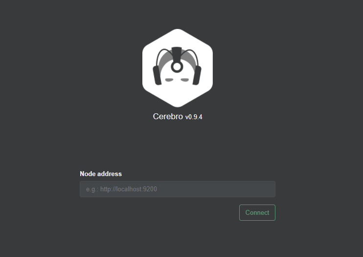
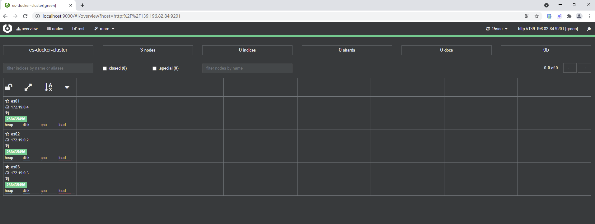
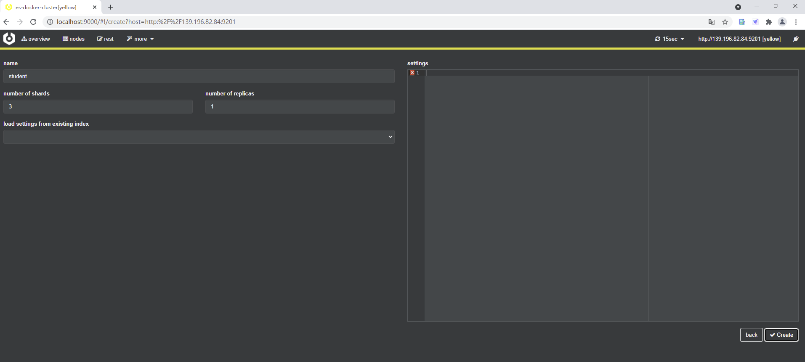
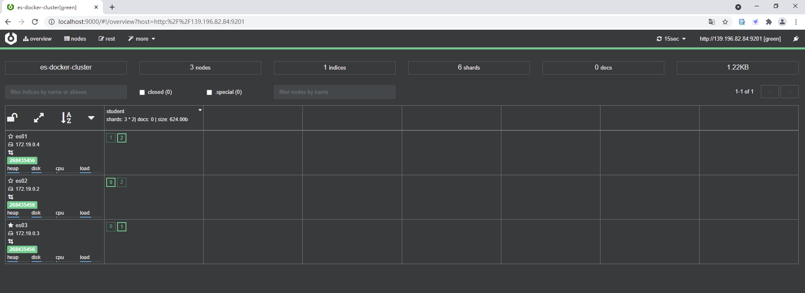
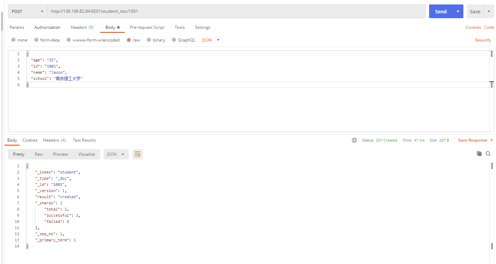
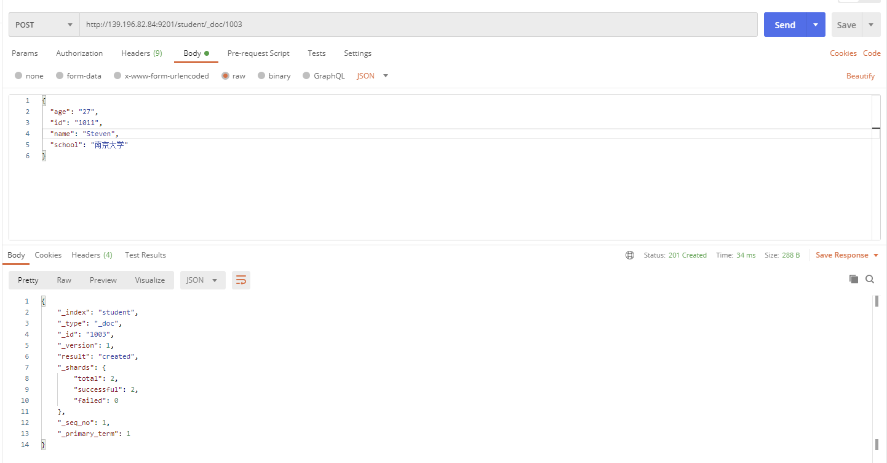
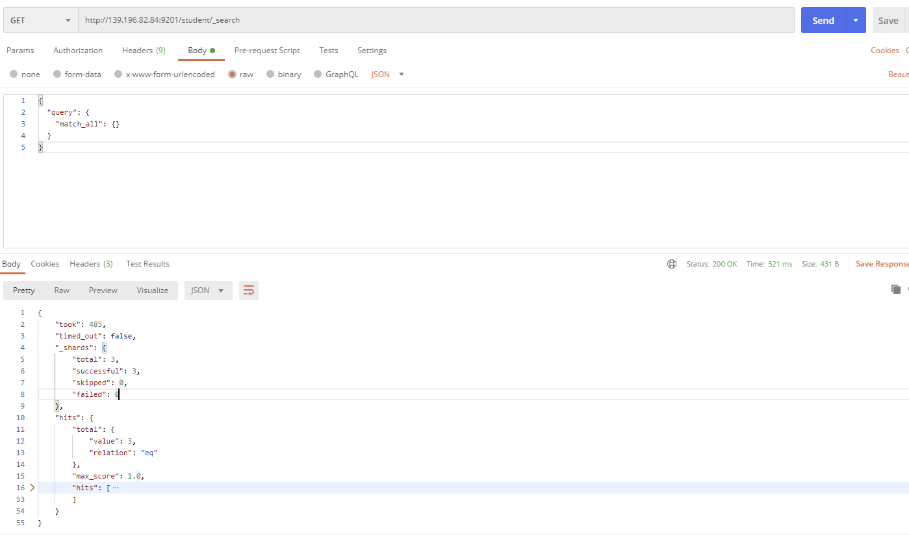
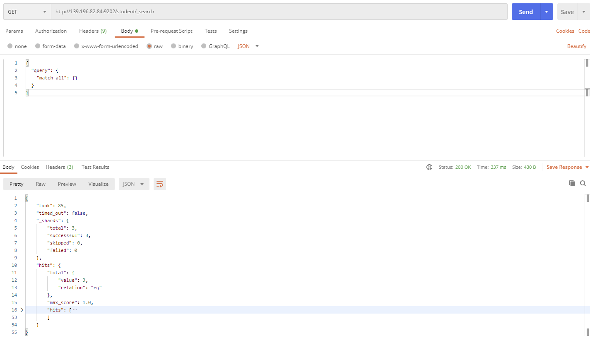
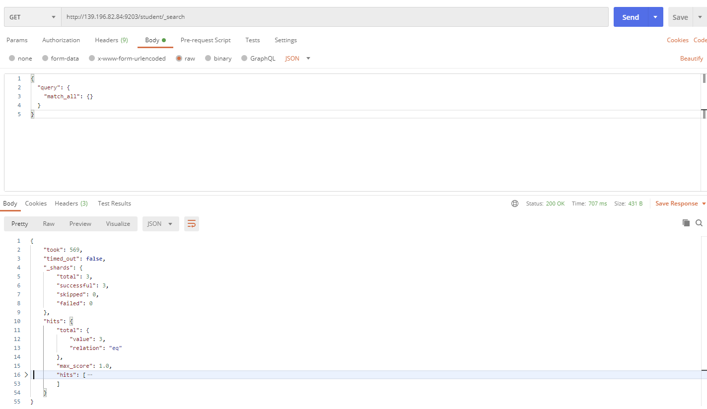
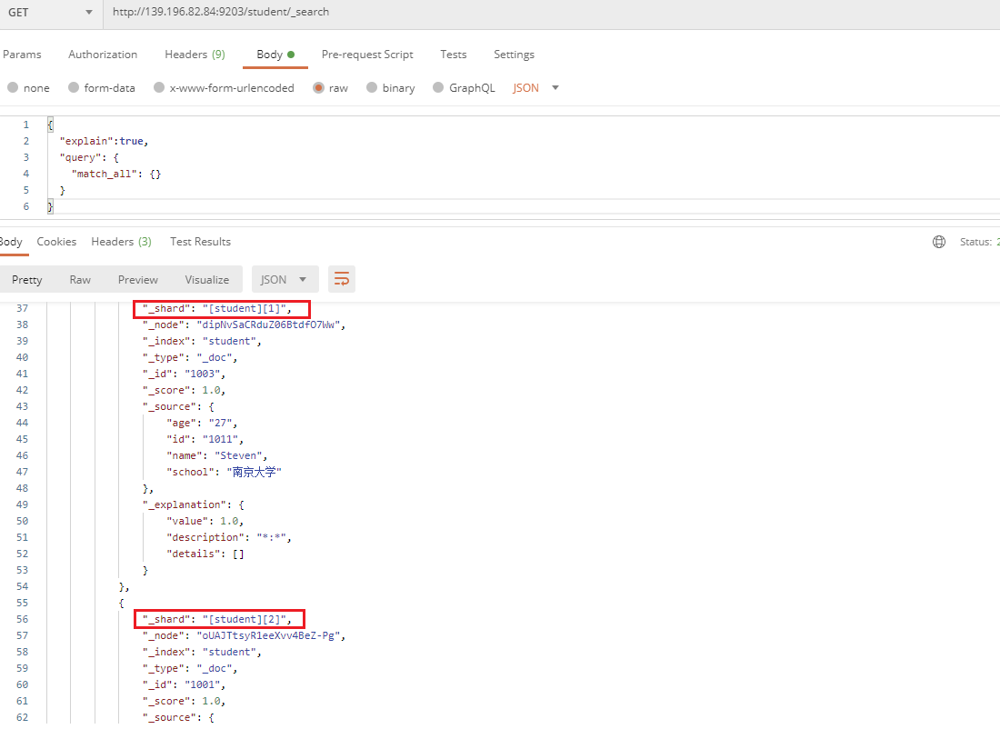

# 部署es集群

我们会在单机上利用docker容器运行多个es实例来模拟es集群。不过生产环境推荐大家每一台服务节点仅部署一个es的实例。

部署es集群可以直接使用docker-compose来完成，但这要求你的Linux虚拟机至少有**4G**的内存空间,如果内存不足，可以Xms512m改小成Xms256m

## 创建es集群

首先编写一个docker-compose文件，内容如下：

```sh
version: '2.2'
services:
  es01:
    image: elasticsearch:7.12.1
    container_name: es01
    environment:
      - node.name=es01
      - cluster.name=es-docker-cluster
      - discovery.seed_hosts=es02,es03
      - cluster.initial_master_nodes=es01,es02,es03
      - "ES_JAVA_OPTS=-Xms512m -Xmx512m"
    volumes:
      - data01:/usr/share/elasticsearch/data
    ports:
      - 9200:9200
    networks:
      - elastic
  es02:
    image: elasticsearch:7.12.1
    container_name: es02
    environment:
      - node.name=es02
      - cluster.name=es-docker-cluster
      - discovery.seed_hosts=es01,es03
      - cluster.initial_master_nodes=es01,es02,es03
      - "ES_JAVA_OPTS=-Xms512m -Xmx512m"
    volumes:
      - data02:/usr/share/elasticsearch/data
    ports:
      - 9201:9200
    networks:
      - elastic
  es03:
    image: elasticsearch:7.12.1
    container_name: es03
    environment:
      - node.name=es03
      - cluster.name=es-docker-cluster
      - discovery.seed_hosts=es01,es02
      - cluster.initial_master_nodes=es01,es02,es03
      - "ES_JAVA_OPTS=-Xms512m -Xmx512m"
    volumes:
      - data03:/usr/share/elasticsearch/data
    networks:
      - elastic
    ports:
      - 9202:9200
volumes:
  data01:
    driver: local
  data02:
    driver: local
  data03:
    driver: local

networks:
  elastic:
    driver: bridge
```

es运行需要修改一些linux系统权限，修改`/etc/sysctl.conf`文件

```sh
vi /etc/sysctl.conf
```

添加下面的内容：

```sh
vm.max_map_count=262144
```

然后执行命令，让配置生效：

```sh
sysctl -p
```
通过docker-compose启动集群：

```sh
docker-compose up -d
```

## 集群状态监控

kibana可以监控es集群，不过新版本需要依赖es的x-pack 功能，配置比较复杂。

这里推荐使用cerebro来监控es集群状态，官方网址：https://github.com/lmenezes/cerebro

安装包如下：


解压好的目录如下：


进入对应的bin目录：


双击其中的cerebro.bat文件即可启动服务。


访问http://localhost:9000 即可进入管理界面：



输入你的elasticsearch的任意节点的地址和端口，点击connect即可。

**连接后的界面如下**：绿色的条，代表集群处于绿色（健康状态）。



## 创建索引库

### 利用kibana的DevTools创建索引库

在DevTools中输入指令：

```json
PUT /itcast
{
  "settings": {
    "number_of_shards": 3, // 分片数量
    "number_of_replicas": 1 // 副本数量
  },
  "mappings": {
    "properties": {
      // mapping映射定义 ...
    }
  }
}
```

### 利用cerebro创建索引库

利用cerebro还可以创建索引库：输入信息完成后，点击create



## 查看分片效果

回到首页，即可查看索引库分片效果：



## 创建文档

利用postman创建文档数据:






## 查询文档

利用postman查询文档数据:

**因为是ES集群，虽然上面文档数据时从9201端口新建的，其他9202和9203端口都能查到对应数据。**








## 查询文档

利用explain字段，进一步查看分库信息，可以看到对应字段数据所属分片：


