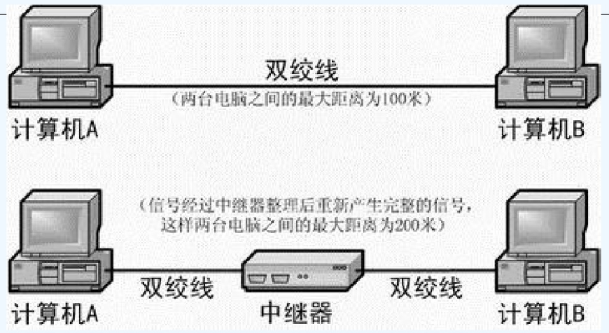
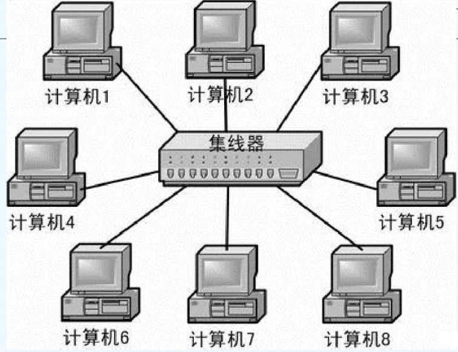
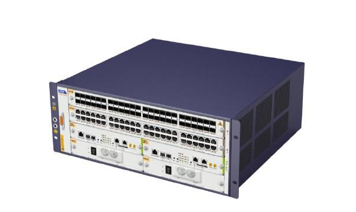
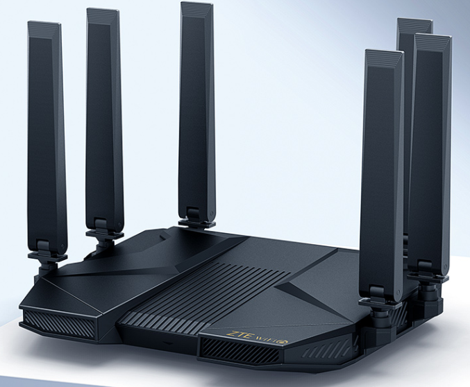

网络硬件三剑客的集线器（Hub）、交换机（Switch）与路由器（Router）

# 集成器

##  什么是集线器

在认识集线器之前，必须先了解一下中继器。在我们接触到的网络中， **最简单的就是两台电脑通过两块网卡构成“双机互连”，两块网卡之间一般是由非屏蔽双绞线来充当信号线的。**由于双绞线在传输信号时信号功率会逐渐衰减，当信号衰减到一定程度时将造成信号失真，因此在保证信号质量的前提下，双绞线的最大传输距离为100米。当两台电脑之间的距离超过100米时，为了实现双机互连，人们便在这两台电脑之间安装一个“中继器”，它的作用就是将已经衰减得不完整的信号经过整理，重新产生出完整的信号再继续传送。

 

中继器就是普通集线器的前身，集线器实际就是一种多端口的中继器。集线器一般有4、8、16、24、32等数量的RJ45接口，通过这些接口，集线器便能为相应数量的电脑完成“中继”功能。由于它在网络中处于一种“中心”位置，因此集线器也叫做“Hub”。

## 集线器的工作原理

集线器的工作原理很简单，以下图为例，图中是一个具备8个端口的集线器，共连接了8台电脑。集线器处于网络的“中心”，通过集线器对信号进行转发，8台电脑之间可以互连互通。具体通信过程是这样的：假如计算机1要将一条信息发送给计算机8，当计算机1的网卡将信息通过双绞线送到集线器上时，**集线器并不会直接将信息送给计算机8，它会将信息进行“广播”--将信息同时发送给8个端口**，当8个端口上的计算机接收到这条广播信息时，会对信息进行检查，如果发现该信息是发给自己的，则接收，否则不予理睬。由于该信息是计算机1发给计算机8的，因此最终计算机8会接收该信息，而其它7台电脑看完信息后，会因为信息不是自己的而不接收该信息。

 

## 集线器的特点

### 共享带宽

**集线器的带宽是指它通信时能够达到的最大速度。**

目前市面上用于中小型局域网的集线器主要有10Mbps、100Mbps和10/100Mbps自适应三种。

* 10Mb带宽的集线器的传输速度最大为10Mbps，即使与它连接的计算机使用的是100Mbps网卡，在传输数据时速度仍然只有10Mbps。

* 10/100Mbps自适应集线器能够根据与端口相连的网卡速度自动调整带宽，当与10Mbps的网卡相连时，其带宽为10Mb；与100Mbps的网卡相连时，其带宽为100Mb，因此这种集线器也叫做“双速集线器”。 

**集线器是一种“共享”设备，集线器本身不能识别目的地址。**

* 当同一局域网内的A主机给B主机传输数据时，数据包在以集线器为架构的网络上是以广播方式传输的，由每一台终端通过验证数据包头的地址信息来确定是否接收。
* 由于集线器在一个时钟周期中只能传输一组信息，如果一台集线器连接的机器数目较多，并且多台机器经常需要同时通信时，将导致集线器的工作效率很差，如发生信息堵塞、碰撞等。为什么会这样呢?
  * 例如上图当计算机1正在通过集线器发信息给计算机8时，如果此时计算机2也想通过集线器将信息发给计算机7，当它试图与集线器联系时，却发现集线器正在忙计算机1的事情，于是计算机2便会“带”着数据站在集线器的面前等待，并时时要求集线器停下计算机1的活来帮自己干。如果计算机2成功地将集线器“抢”过来了（由于集线器是“共享”的，因此很容易抢到手），此时正处于传输状态的计算机1的数据便会停止，于是计算机1也会去“抢”集线器……

可见，集线器上每个端口的真实速度除了与集线器的带宽有关外，与同时工作的设备数量也有关。比如说一个带宽为10Mb的集线器上连接了8台计算机，当这8台计算机同时工作时，则每台计算机真正所拥有的带宽是10/8=1.25Mb!

### 半双工

先说说全双工：两台设备在发送和接收数据时，通信双方都能在同一时刻进行发送或接收操作，这样的传送方式就是全双工。而处于半双工传送方式的设备，当其中一台设备在发送数据时，另一台只能接收，而不能同时将自己的数据发送出去。

由于集线器采取的是“广播”传输信息的方式，因此集线器传送数据时只能工作在半双工状态下，比如说计算机1与计算机8需要相互传送一些数据，当计算机1在发送数据时，计算机8只能接收计算机1发过来的数据，只有等计算机1停止发送并做好了接收准备，它才能将自己的信息发送给计算机1或其它计算机。

# 交换机

## 什么是交换机

交换机也叫交换式集线器，它通过对信息进行重新生成，并经过内部处理后转发至指定端口，**具备自动寻址能力和交换作用**，由于交换机根据所传递信息包的目的地址，将每一信息包独立地从源端口送至目的端口，避免了和其他端口发生碰撞。广义的交换机就是一种在通信系统中完成信息交换功能的设备。

 

## 交换机的工作原理

在计算机网络系统中，**交换机是针对共享工作模式的弱点而推出的，集线器是采用共享工作模式的代表**。

* 集线器是个的“不识字”的邮递员--要他去送信，他不知道直接根据信件上的地址将信件送给收信人，只会拿着信分发给所有的人，然后让接收的人根据地址信息来判断是不是自己的。
* 交换机是一个“聪明”的邮递员--交换机拥有一条高带宽的背部总线和内部交换矩阵。交换机的所有的端口都挂接在这条背部总线上，当控制电路收到数据包以后，处理端口会查找内存中的地址对照表以确定目的MAC（网卡的硬件地址）的NIC（网卡）挂接在哪个端口上，通过内部交换矩阵迅速将数据包传送到目的端口。目的MAC若不存在，交换机才广播到所有的端口，接收端口回应后交换机会“学习”新的地址，并把它添加入内部地址表中。

可见，交换机在收到某个网卡发过来的“信件”时，会根据上面的地址信息，以及自己掌握的“常住居民户口簿”快速将信件送到收信人的手中。万一收信人的地址不在“户口簿”上，交换机才会像集线器一样将信分发给所有的人，然后从中找到收信人。而找到收信人之后，交换机会立刻将这个人的信息登记到“户口簿”上，这样以后再为该客户服务时，就可以迅速将信件送达了。

## 交换机的性能特点

### 独享带宽

由于交换机能够智能化地根据地址信息将数据快速送到目的地，因此它不会像集线器那样在传输数据时“打扰”那些非收信人。这样一来，交换机在同一时刻可进行多个端口组之间的数据传输。并且每个端口都可视为是独立的网段，相互通信的双方独自享有全部的带宽，无须同其他设备竞争使用。比如说，当A主机向D主机发送数据时，B主机可同时向C主机发送数据，而且这两个传输都享有网络的全部带宽--假设此时它们使用的是10Mb的交换机，那么该交换机此时的总流通量就等于2×10Mb=20Mb。

### 全双工

当交换机上的两个端口在通信时，由于它们之间的通道是相对独立的，因此它们可以实现全双工通信。

* 在认识集成器之前集线器的工作原理很简单，以图2为例，图中是一个具备8个端口的集线器，共连接了8台电脑。集线器处于网络的“中心”，通过集线器对信号进行转发，8台电脑之间可以互连互通。具体通信过程是这样的：假如计算机1要将一条信息发送给计算机8，当计算机1的网卡将信息通过双绞线送到集线器上时，集线器并不会直接将信息送给计算机8，它会将信息进行“广播”--将信息同时发送给8个端口，当8个端口上的计算机接收到这条广播信息时，会对信息进行检查，如果发现该信息是发给自己的，则接收，否则不予理睬。由于该信息是计算机1发给计算机8的，因此最终计算机8会接收该信息，而其它7台电脑看完信息后，会因为信息不是自己的而不接收该信息。
* 在计算机网络系统中，交换机是针对共享工作模式的弱点而推出的。集线器是采用共享工作模式的代表，如果把集线器比作一个邮递员，那么这个邮递员是个不认识字的“傻瓜”--要他去送信，他不知道直接根据信件上的地址将信件送给收信人，只会拿着信分发给所有的人，然后让接收的人根据地址信息来判断是不是自己的!而交换机则是一个“聪明”的邮递员--交换机拥有一条高带宽的背部总线和内部交换矩阵。交换机的所有的端口都挂接在这条背部总线上，当控制电路收到数据包以后，处理端口会查找内存中的地址对照表以确定目的MAC（网卡的硬件地址）的NIC（网卡）挂接在哪个端口上，通过内部交换矩阵迅速将数据包传送到目的端口。目的MAC若不存在，交换机才广播到所有的端口，接收端口回应后交换机会“学习”新的地址，并把它添加入内部地址表中。
* 路由器（Router）是用于连接多个逻辑上分开的网络，所谓逻辑网络是代表一个单独的网络或者一个子网。当数据从一个子网传输到另一个子网时，可通过路由器来完成。因此，路由器具有判断网络地址和选择路径的功能，它能在多网络互联环境中，建立灵活的连接，可用完全不同的数据分组和介质访问方法连接各种子网，路由器只接受源 站或其他路由器的信息，属网络层的一种互联设备。它不关心各子网使用的硬件设备，但要求运行与网络层协议相一致的软件。路由器分本地路由器和远程路由器，本地路由器是用来连接网络传输介质的，如光纤、同轴电缆、双绞线；远程路由器是用来连接远程传输介质，并要求相应的设备，如电话线要配调制解调器，无线要通过无线接收机、发射机

# 路由器

 

## 路由器的作用

通过集线器或交换机，我们可以将很多台电脑组成一个比较大的局域网。

但是当机器的数量达到一定数目时，问题也就来了：

* 对于用集线器构成的局域网而言，由于采用“广播”工作模式，当网络规模较大时，信息在传输过程中出现碰撞、堵塞的情况越来越严重，即使是交换机，这种情况也同样存在。
* 其次，这种局域网不安全，也不利于管理。

为了解决这些问题，人们便将一个较大的网络划分为一个个小的子网、网段，或者直接将它们划分为多个VLAN（即虚拟局域网）。

* 在一个VLAN内，一台主机发出的信息只能发送到具有相同VLAN号的其他主机，其他VLAN的成员收不到这些信息或广播帧。
* 采用VLAN划分网络后，可有效地抑制网络上的广播风暴，增加网络的安全性，使管理控制集中。
* 既然是局域网，万一分别处于不同VLAN的主机需要互相通信时该怎么办呢?这时候就得通过路由器（Router，转发者）来帮忙了。**路由器可以将处于不同子网、网段、VLAN的电脑连接起来，让它们自由通信。**另外，我们都知道目前的网络有很多种结构类型，且不同网络所使用的协议、速度也不尽相同。当两个不同结构的网络需要互连时，也可以通过路由器来实现。路由器可以使两个相似或不同体系结构的局域网段连接到一起，以构成一个更大的局域网或一个广域网。 可见，路由器是一种连接多个网络或网段的网络设备，它能将不同网络、网段或VLAN之间的数据信息进行“翻译”，以使它们能够相互“读”懂对方的数据，从而构成一个更大的网络。

## 路由器的工作原理

所谓路由就是指通过相互连接的网络把信息从源地点移动到目标地点的活动。

那么路由器具体是如何进行“翻译”工作的呢?

* 对于路由器而言，它有这种用于翻译的字典--路径表。路径表（Routing Table）保存着各种传输路径的相关数据，如子网的标志信息、网上路由器的个数和下一个路由器的名字等内容。路径表可以是由系统管理员固定设置好的，也可以由系统动态修改，可以由路由器自动调整，也可以由主机控制。

通过路由器可以让不同子网、网段进行互连，因此路由器与集线器、交换机不同，它一般安装在网络的“骨干”部位，而不像集线器、交换机那样工作在基层。比如说一个较大规模的企业局域网，基于管理、安全、性能的考虑，一般都会将整个网络划分为多个VLAN，如此一来，当VLAN与VLAN之间进行通讯时，就必须使用路由器。对于该企业网而言，肯定还需要与互联网相连，对于企业而言，一般都是通过租用电信的DDN专线或者利用ADSL、Cable、ISDN等方式将企业网接入互联网，而此时由于网络体系及所用协议的不同，也需要路由器来完成企业网与互联网的互连工作。

一般来说，在路由过程中，信息至少会经过一个或多个中间节点。通常，人们会把路由和交换进行对比，这主要是因为在普通用户看来两者所实现的功能是完全一样的。其实，路由和交换之间的主要区别就是交换发生在OSI参考模型的第二层（数据链路层），而路由发生在第三层，即网络层。这一区别决定了路由和交换在移动信息的过程中需要使用不同的控制信息，所以两者实现各自功能的方式是不同的。路由器通过路由决定数据的转发。转发策略称为路由选择，这也是路由器名称的由来。

# 三者区别

路由器是工作在网络层上的（通过IP实现网络连接）。
交换机是工作在数据链路层上的 （通过数据帧传播信息）。
集成器是工作在物理层上的（通过传输二进制比特流101011010101传播数据的）。

当我们为家中部署WiFi网络时，有两样设备必不可少，一个是无线路由器，另外一个就是调制解调器或光猫。

* 调制解调器或光猫，是接入互联网必不可少的设备，一般由宽带运营商提供。通过电话线、光纤连接到设备上，再从设备上使用网线与无线路由器相连。

* 现在我国正在大力普及光纤宽带，使用调制解调器连接电话线上网已经淘汰，光纤与光猫已经成为了上网的主力军。另外，如果用户是近几年新建的住宅，一般运营商会把光纤接入到楼，用户直接从家中墙面上的网口，连接无线路由器即可享受高速宽带。

IP地址扩展：

IPv4是32位二进制，而IPv6是128位二进制。(IETF在意识到IP地址即将用尽后，推出的下个版本跳过了64位，直接一步到位干到128位。)

客户端和服务器通过因特网这个全球网络来通信。从程序员的观点来看，我们可以把因特网看成是一个全球范围的主机集合，具有以下几个属性：

1、每个因特网主机都有一个唯一的 32 为名字，称为它的 IP 地址

2、IP 地址的集合被映射为一个因特网域名的集合

3、不同因特网主机上的进程能够通过链接互相通信

机器手，相机都是通过千兆网卡与计算机通信，同时千兆网卡是IPC槽。

